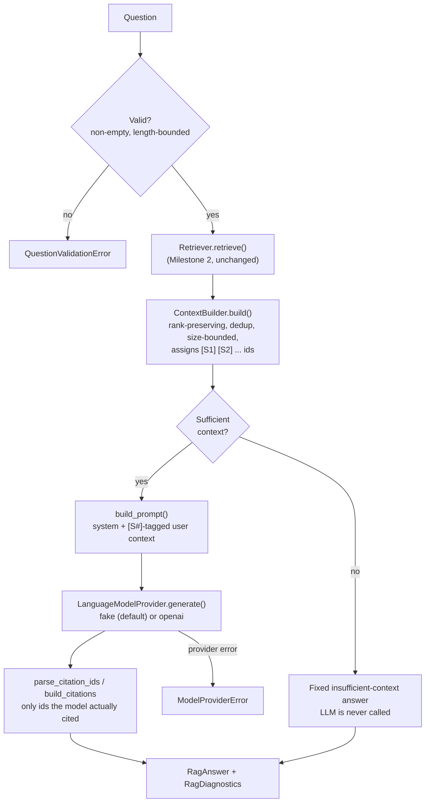
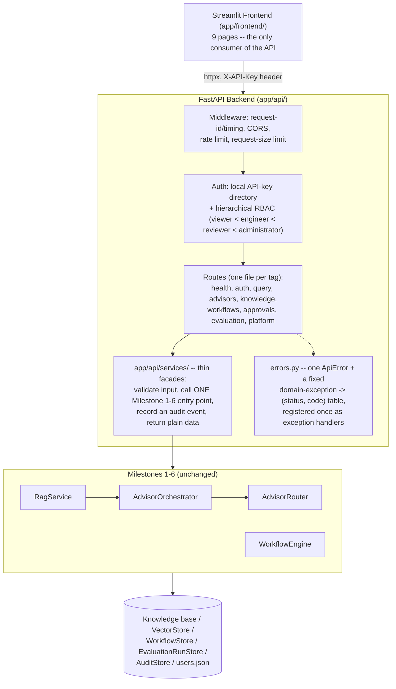
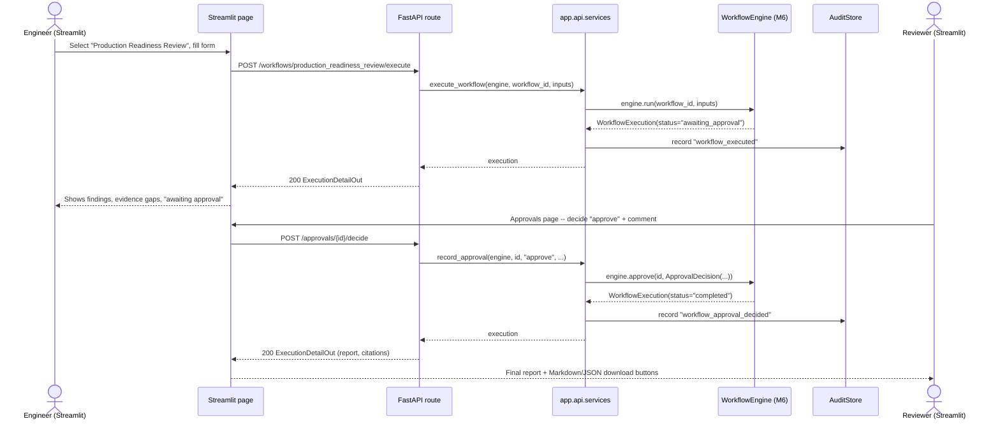
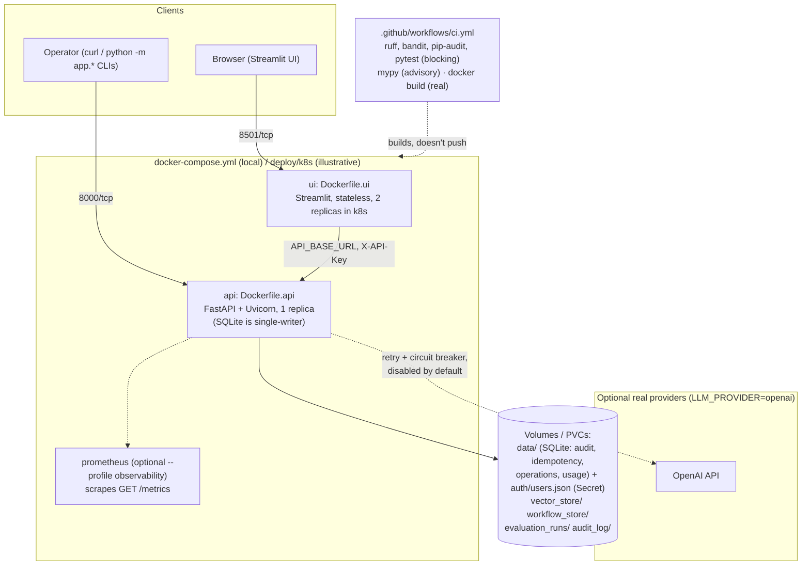
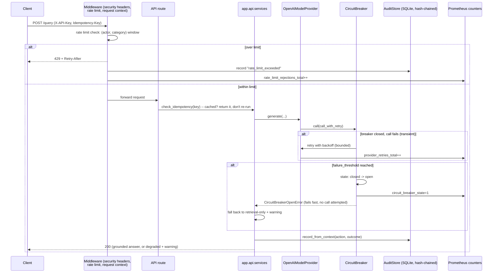

# HAIE Platform

**The Reference Implementation of Human-AI Enterprise Engineering**

An enterprise AI transformation platform — enterprise RAG, specialized
engineering advisors, architecture review support, AI governance,
DevSecOps guidance, testing/release advisors, incident response
assistance, and evaluation/observability — built incrementally,
milestone by milestone, and hardened for real operations.

## Platform vs. reference enterprise

The HAIE Platform is general-purpose: nothing in its code, API, or
workflows is specific to any one company. To demonstrate and test it
end to end, it's evaluated against a **reference enterprise** —
**NorthStar Lending Corporation**, a fictional mid-sized digital
lending company with its own knowledge base, sample data, workflows,
personas, and test cases. The two evolve independently:

```
HAIE Platform
│
├── Platform            (app/config, app/rag, app/agents, app/workflows, ...)
├── Resilience & ops     (app/resilience, app/db, app/operations, app/release)
├── HAIR                 Human–AI Reference Architecture (this codebase's design)
├── HAIO                 Human–AI Operating Model (RBAC, audit, approvals, workflows)
└── Reference Enterprise
      │
      └── NorthStar Lending Corporation (fictional)
            ├── Knowledge base    (enterprise_knowledge_base/)
            ├── Sample data       (data/, examples/)
            ├── Workflows         (loan/architecture/incident review scenarios)
            ├── Tests             (tests/)
            └── Personas          (data/auth/ roles: viewer/engineer/reviewer/administrator)
```

Every "Northstar"/"NorthStar Lending" mention elsewhere in this README
and in `enterprise_knowledge_base/` refers to this reference enterprise
— the demonstration environment — not the platform itself. If this
project is published or cited, the intended framing is: *"The HAIE
Platform was evaluated using a reference enterprise, NorthStar Lending,
a fictional mid-sized lending institution designed to represent
realistic enterprise workflows."*

## Future evolution

As the platform matures, the surrounding ecosystem this codebase is
one node of naturally becomes:

```
HAIE (Human–AI Enterprise Engineering)
        │
        ├── HAIE Manifesto
        ├── HAIE Body of Knowledge
        ├── HAIR   Human–AI Reference Architecture
        ├── HAIO   Human–AI Operating Model
        ├── HAIG   Human–AI Governance Framework
        ├── HAIA   Human–AI Agent Architecture (future)
        ├── HAIX   Human–AI Experience (future)
        └── HAIE Platform   Reference implementation (this repository)
```

This repository is, and will remain, the **HAIE Platform** node: a
concrete, runnable reference implementation — not the Manifesto, Body
of Knowledge, or governance framework themselves, which would be
separate, non-code artifacts if they materialize. Nothing above is
committed or scheduled; it's the natural shape the ecosystem takes if
the platform continues to mature past Milestone 8.

## Status

| Milestone | Scope | Status |
|---|---|---|
| **1** | Knowledge ingestion foundation | ✅ Complete |
| **2** | Semantic indexing & retrieval | ✅ Complete |
| **3** | Grounded RAG assistant (CLI) | ✅ Complete |
| **4** | Pluggable advisor framework (10 domain advisors) | ✅ Complete |
| **5** | Advisor router & controlled multi-advisor synthesis | ✅ Complete |
| **6** | Enterprise workflow orchestration (5 review workflows) | ✅ Complete |
| **7** | Enterprise AI Platform: FastAPI + Streamlit, RBAC, audit, evaluation persistence, export | ✅ Complete |
| **8** | Production hardening & operations: containerization, observability, resilience, security, release controls | ✅ Complete |

## Milestone 1 — Knowledge Ingestion Foundation

A pipeline that discovers Northstar Markdown documents, loads them safely,
extracts metadata, and splits them into Markdown-aware chunks — producing
structured output ready for a future embedding/vector-store step. No LLM
calls, embeddings, vector DB, RAG, or agent logic are included yet.

```
enterprise_knowledge_base/*.md
        │
        ▼
DocumentDiscoveryService   (app/ingestion/document_loader.py)
        │  recursively finds *.md, skips hidden/generated files, deterministic order
        ▼
MarkdownLoader              (app/ingestion/markdown_loader.py)
        │  UTF-8 read, content hash, mtime, per-file error isolation
        ▼
metadata_extractor          (app/ingestion/metadata_extractor.py)
        │  YAML frontmatter + heading structure
        ▼
MarkdownChunker              (app/embeddings/chunking.py)
        │  heading-aware segmentation, small-fragment merge, size/overlap split
        ▼
IngestionPipeline            (app/ingestion/pipeline.py)
        │  orchestrates the above, persists artifacts
        ▼
data/processed/{chunks.jsonl, errors.json, summary.json}
```

### Setup

```bash
python -m venv .venv
.venv\Scripts\activate            # Windows
pip install -r requirements-dev.txt
cp .env.example .env               # adjust if needed; defaults work out of the box
```

### Run the pipeline

```bash
python -m app.ingestion.pipeline
```

This scans `enterprise_knowledge_base/` and writes chunked output to
`data/processed/` (git-ignored — regenerate locally rather than committing it).

Last verified run: **42 files discovered, 0 load errors, 820 chunks produced.**

### Run the tests

```bash
python -m pytest
```

69 tests cover configuration validation, discovery, loading, metadata
extraction, chunking, the end-to-end ingestion pipeline (Milestone 1),
plus the embedding provider, vector store, incremental indexer, and
retriever (Milestone 2). All Milestone 2 tests use the local embedding
provider — no network calls, no API key required. (58 further Milestone 3
tests, 53 further Milestone 4 advisor tests, 32 further Milestone 5
router/orchestrator tests, and 103 further Milestone 6 workflow tests
are described below — 317 total.)

### Configuration

All settings are environment-driven (see `.env.example`), loaded via
`app/config/settings.py::IngestionSettings.from_env()`, and validated eagerly
with clear errors on invalid/missing paths:

| Variable | Default | Meaning |
|---|---|---|
| `KNOWLEDGE_BASE_DIRS` | `enterprise_knowledge_base` | Comma-separated dirs to scan |
| `SUPPORTED_EXTENSIONS` | `.md` | Comma-separated file extensions |
| `CHUNK_SIZE` | `1500` | Max chunk length, in characters |
| `CHUNK_OVERLAP` | `200` | Overlap between split chunks, in characters |
| `LOG_LEVEL` | `INFO` | Logging verbosity |
| `INGESTION_OUTPUT_DIR` | `data/processed` | Where artifacts are written |

### Chunk output shape

```json
{
  "chunk_id": "fed3614a19ef2633",
  "text": "chunk content...",
  "chunk_index": 17,
  "document_title": "Northstar Lending Corporation - Incident Management Standard",
  "document_id": "NLC-ENG-007",
  "source_file": "16_Incident_Management.md",
  "source_path": "04_Engineering/16_Incident_Management.md",
  "section_title": "10. Major Incident Management",
  "heading_path": ["10. Major Incident Management"],
  "content_hash": "610b8bc5...",
  "char_count": 462
}
```

## Milestone 2 — Semantic Indexing & Retrieval

Embeds Milestone 1's chunks, stores them in a persistent local vector
store, keeps that index in sync as documents change, and retrieves the
most relevant chunks for a question — with diagnostics, so retrieval
quality can be checked before any LLM is introduced. No answer
generation, agents, advisor routing, API, UI, or conversation memory.

```
Chunk (Milestone 1)
        │
        ▼
EmbeddingProvider            (app/embeddings/vectorizer.py, openai_provider.py)
        │  local (default, offline) or openai — same interface either way
        ▼
Indexer                      (app/embeddings/indexer.py)
        │  incremental sync: content-addressed chunk_id set-diff (add/remove/skip-unchanged)
        ▼
VectorStore                  (app/embeddings/vector_store.py)
        │  numpy + JSON, persisted to vector_store/
        ▼
Retriever                    (app/rag/retriever.py)
        │  embeds a question, searches the store, ranks + returns diagnostics
        ▼
RetrievalResponse  (results + diagnostics)
```

### Embedding providers

Both implement the same `EmbeddingProvider` protocol
(`app/embeddings/vectorizer.py`); nothing outside `app/embeddings/`
imports a vendor SDK directly.

- **`local`** (default) — `LocalHashingEmbeddingProvider`: dependency-free,
  fully offline, deterministic signed feature hashing over word tokens
  (a lightweight bag-of-words / TF retriever via cosine similarity). No
  API key needed; this is what the test suite and CI use.
- **`openai`** — `OpenAIEmbeddingProvider`: real semantic embeddings via
  the OpenAI embeddings API. Only imports the `openai` package (`pip
  install openai`) when actually selected; requires `OPENAI_API_KEY`.

### Run the indexer

```bash
python -m app.rag.index
```

(`app.rag.index` is a thin alias for `app.embeddings.indexer` — both work;
`app.rag.index` is the canonical command since Milestone 3, keeping all
user-facing RAG commands under one namespace: `app.rag.index` /
`app.rag.ask` / `app.rag.evaluate`.)

Runs the Milestone 1 pipeline in-process, then syncs the vector store:
new/changed chunks are embedded and upserted, chunks for removed/edited
content are deleted, unchanged chunks are skipped (no re-embedding
cost). Verified against the real knowledge base: **820/820 chunks
indexed**; re-running with no source changes reports `added=0,
removed=0, unchanged=820`.

### Query the index

```bash
python -m app.rag.retriever "What is the target response time for a Sev1 incident?" --top-k 5
```

Prints ranked results (score, source file, heading path, text preview)
plus diagnostics (provider/model, index size, embed/search latency).
Confirmed against representative Northstar questions — e.g. an
incident-severity question surfaces `16_Incident_Management.md`, a
lending-product question surfaces `02_Business/05_Lending_Business_Model.md`
and `06_Loan_Lifecycle.md`.

### Configuration additions

| Variable | Default | Meaning |
|---|---|---|
| `EMBEDDING_PROVIDER` | `local` | `local` or `openai` |
| `EMBEDDING_MODEL` | provider-specific | `local-hashing-v1` (local) / `text-embedding-3-small` (openai) |
| `EMBEDDING_DIMENSIONS` | `512` | Vector dimensionality |
| `VECTOR_STORE_DIR` | `vector_store` | Where the persistent index is written |
| `RETRIEVAL_TOP_K` | `5` | Default results per query |
| `OPENAI_API_KEY` | — | Required only when `EMBEDDING_PROVIDER=openai` |

Validated eagerly by `RetrievalSettings.from_env()` in the same
`app/config/settings.py`, alongside (and independent of)
`IngestionSettings`.

## Milestone 3 — Grounded Enterprise RAG Assistant (CLI)

The first working question-answering workflow: retrieve → bound the
context → prompt → call a language model → parse citations → return a
typed, diagnosable answer — with explicit insufficient-context handling
so the assistant never invents Northstar policy. **This is a portfolio
reference implementation, not a production compliance tool** — see
Limitations and Security below. No specialized advisors, agent routing,
UI, or autonomous actions.



### Language model providers

Both implement the same `LanguageModelProvider` protocol
(`app/services/llm_service.py`); nothing outside `app/services/` imports
a vendor SDK directly.

- **`fake`** (default) — `FakeModelProvider`: dependency-free, fully
  offline, deterministic. Cites whichever `[S#]` markers appear in the
  prompt so the citation pipeline is exercisable end-to-end without any
  network call or API key. Its answers are clearly non-real placeholder
  text — use it to validate retrieval/context/citation mechanics, not
  answer quality.
- **`openai`** — `OpenAIModelProvider`: real grounded answers via the
  OpenAI Chat Completions API (same `openai` package already optional for
  Milestone 2's embedding provider). Requires `LLM_API_KEY`.

### Configure credentials

```bash
cp .env.example .env
# For real grounded answers:
#   LLM_PROVIDER=openai
#   LLM_API_KEY=sk-...
# (embeddings can independently use EMBEDDING_PROVIDER=local or =openai
#  with its own OPENAI_API_KEY — the two providers are decoupled)
```

### Run it end to end

```bash
pytest                                # run the full test suite
python -m app.rag.index               # discover + chunk + embed + index
python -m app.rag.ask "How should a Sev-1 incident be handled?"
python -m app.rag.ask "How should a Sev-1 incident be handled?" --show-diagnostics
python -m app.rag.ask "What is Northstar's current stock price?"  # insufficient-context
python -m app.rag.evaluate            # run the seed evaluation suite
```

Useful flags: `--top-k`, `--min-score`, `--model`, `--show-context`,
`--show-diagnostics`, `--show-prompts` (never exposes secrets — only the
rendered system/user prompt text), `--source-file`, `--document-id`.

### How citations work

The system prompt instructs the model to cite claims inline as `[S1]`,
`[S2]`, ... matching the numbered sources it was given.
`app/rag/citation_engine.py` then deterministically parses those markers
out of the answer text, drops duplicates (keeping first use), and — this
is the important part — **only returns a `Citation` for ids the model
actually cited**. An id that was retrieved but never referenced doesn't
appear; an id the model hallucinates (e.g. `[S12]` when only `[S1]`–`[S3]`
existed) is dropped and recorded as a warning, never fabricated into a
`Citation`.

### How insufficient context is handled

`ContextBuilder` classifies sufficiency from the *raw retrieval results*
— no results, best score below threshold, or nothing usable after
filtering — **before** any prompt is built. When insufficient, the
language model is never called; the CLI prints a fixed message stating
that the knowledge base didn't have enough information, along with how
many chunks were searched, how many were retrieved, and the highest
relevance score.

### Diagnostics

`--show-diagnostics` prints `RagDiagnostics`: request id, retrieval/embed/
search timings, retrieved vs. context chunk counts, exclusions, highest
score, model provider/name/latency, token usage, prompt version, and
total duration. Not shown by default to keep normal output readable.

### Run the tests

```bash
python -m pytest
```

319 tests total (69 from Milestones 1–2 + 58 from Milestone 3 + 53 from
Milestone 4 + 32 from Milestone 5 + 105 from Milestone 6, all
unchanged/additive). All Milestone 3 tests use `FakeModelProvider`;
`OpenAIModelProvider` is tested by injecting a fake `openai` module into
`sys.modules`, exercising
the real request-building/retry/error-translation logic with zero
network calls and no installed SDK required.

### Run the evaluation

```bash
python -m app.rag.evaluate
```

(alias for `app.evaluation.rag_evaluator`, kept alongside it for
completeness in the `app.rag.*` command surface.)

Checks ~14 seed questions (`data/evaluation_sets/milestone3_eval.json`)
against a real `RagService`: whether the expected document was
retrievable, whether citations were produced, whether sufficient-context
classification matched expectations, and whether required concepts
appear in the answer. Deterministic checks only — no LLM-as-judge.

### Sample output (real `LLM_PROVIDER=openai`, `--top-k 3 --show-context`)

```
Question:
What controls are required before deploying AI-generated code?

Answer:
AI-generated code must meet the same engineering standards as
manually written code — readable, maintainable, modular, secure,
testable, and documented — and must never be merged without human
review. [S1]

Recommended Actions
- Route AI-generated changes through the standard code review process
  before merge. [S1]

Risks or Considerations
- The context does not specify additional AI-specific approval gates
  beyond standard review; confirm current policy with Engineering
  leadership before relying on this for a compliance decision.

Sources:
1. Northstar Lending Corporation - AI Engineering Standards — 16. AI-Generated Code Standards
   File: 04_Engineering/12_AI_Engineering_Standards.md
   Score: 0.42
```

### Sample output (insufficient context, any provider)

```
Question:
What is Northstar's current stock price?

Answer:
I could not find enough information in the Northstar knowledge base to answer this reliably.

The most relevant documents found were not closely related to this question.
Documents searched: 820 indexed chunks. Retrieved results: 5. Highest relevance score: 0.226.
Consider rephrasing the question with more specific Northstar terminology. This response is
based solely on the Northstar knowledge base; general industry guidance was not used.
```

### Configuration additions

| Variable | Default | Meaning |
|---|---|---|
| `LLM_PROVIDER` | `fake` | `fake` (offline) or `openai` |
| `LLM_MODEL` | provider-specific | `gpt-4o-mini` for `openai` |
| `LLM_API_KEY` | — | Required only when `LLM_PROVIDER=openai`; independent of `OPENAI_API_KEY` used for embeddings |
| `LLM_TEMPERATURE` | `0` | Sampling temperature |
| `LLM_MAX_OUTPUT_TOKENS` | `1024` | Bounds model output size |
| `LLM_TIMEOUT_SECONDS` | `30` | Per-call timeout |
| `CONTEXT_MAX_CHARACTERS` | `6000` | Character-based context budget (not token-based — providers tokenize differently; documented limitation) |
| `CONTEXT_MAX_CHUNKS` | `6` | Max chunks included in context |
| `CONTEXT_MIN_SCORE` | `0.1` | Minimum retrieval score to include a chunk in context |
| `MAX_QUESTION_LENGTH` | `2000` | Guardrail: rejects oversized questions before retrieval |
| `INSUFFICIENT_CONTEXT_MIN_RESULTS` | `1` | Below this many retrieval results → insufficient |
| `INSUFFICIENT_CONTEXT_MIN_SCORE` | `0.15` | Below this top score → insufficient |

### Limitations

- **The default `local` embedding provider (Milestone 2) is lexical, not
  semantic**, and this directly limits Milestone 3's insufficient-context
  detection: a signed-hashing bag-of-words embedding gives even
  topically-unrelated questions (e.g. "Who is the CEO of Northstar in
  real life?") a nontrivial score purely from shared vocabulary
  ("Northstar") and short-vector hash-collision noise, so the default
  threshold does not reliably distinguish "irrelevant" from "relevant" —
  confirmed via `python -m app.rag.evaluate` (both
  insufficient-context seed cases misclassified as sufficient under
  `EMBEDDING_PROVIDER=local`). This is expected to improve substantially
  with `EMBEDDING_PROVIDER=openai`'s real semantic embeddings; it was not
  "fixed" by tuning thresholds against the weak baseline, per the
  milestone's own guidance to keep the threshold logic simple.
- Context construction is character-bounded, not token-bounded — a
  reasonable proxy, but not exact for any specific provider's tokenizer.
- Citation validation is syntactic only (does the `[S#]` exist and match
  a supplied source) — there is no semantic check that the cited source
  actually supports the adjacent claim.
- `FakeModelProvider`'s answers are placeholder text; concept/quality
  checks in the evaluator are only meaningful with a real provider.

### Security considerations

- Retrieved document text is explicitly framed as **untrusted data** in
  the system prompt; embedded instructions in a document are treated as
  content to describe, never as commands (see `test_guardrails.py`).
- No shell execution, infrastructure changes, or other production actions
  are triggered by any model output — this milestone is read-only
  question answering.
- API keys are never logged (verified in tests at INFO level); `.env` is
  git-ignored; `--show-prompts` reveals prompt text only, never secrets.
- The assistant is explicitly instructed not to claim legal, regulatory,
  security, or production-readiness approval, and to preserve human
  accountability for every recommendation.
- **Users must review AI-generated recommendations** — this system
  produces a grounded draft, not an authoritative decision.

### Next milestone

See Milestone 4 below — it delivers the specialized advisors this
section originally flagged as future work.

## Milestone 4 — Pluggable Advisor Framework

Ten domain advisors, each a **thin, declarative specialization** over
the exact same `RagService` from Milestone 3 — a persona, optional
default retrieval filters, and a response structure/extra guidance
layered on top of the same shared grounding guardrails every advisor
gets for free. **No changes to ingestion, indexing, retrieval, citation
parsing, or evaluation** — verified by keeping the entire Milestone 1–3
test suite green and the plain (no-advisor) CLI path byte-identical to
Milestone 3's output. No advisor routing, multi-agent orchestration, UI,
or workflow automation — advisor selection is manual, via `--advisor`
(automatic routing arrives in Milestone 5 below).

| Advisor | id | Default filter | Why |
|---|---|---|---|
| Architecture | `architecture` | `NLC-ENG-002` | Single well-populated source doc |
| AI Engineering | `ai-engineering` | `NLC-ENG-003` | Single well-populated source doc |
| DevSecOps | `devsecops` | `NLC-ENG-004` | Single well-populated source doc |
| Testing | `testing` | `NLC-ENG-005` | Single well-populated source doc |
| Release | `release` | `NLC-ENG-006` | Single well-populated source doc |
| Incident Management | `incident-management` | `NLC-ENG-007` | Single well-populated source doc |
| Platform Engineering | `platform-engineering` | `NLC-ENG-008` | Single well-populated source doc |
| Developer Experience | `developer-experience` | `NLC-ENG-009` | Single well-populated source doc |
| Security | `security` | *(none)* | Cross-cutting: spans DevSecOps + AI Engineering's AI Security section; `Security_Architecture.md` is an empty placeholder |
| Executive AI Transformation | `executive-ai-transformation` | *(none)* | Cross-cutting: "AI Transformation Perspective" content is repeated across many documents |

### How it works

```
Advisor (persona, structure, extra guidance, default filters)
        │
        ▼
build_system_prompt(persona, GROUNDING_GUARDRAILS, extra_guidance, structure)
        │  (app/config/prompt_config.py — same shared guardrails for every advisor)
        ▼
Advisor.ask(service, question, filters=...)
        │  merges default_filters with any caller-supplied filters (caller wins)
        ▼
RagService.ask(question, filters=merged, system_prompt=..., prompt_version=...)
        │  (app/rag/pipeline.py — UNCHANGED Milestone 3 orchestration)
        ▼
RagAnswer (diagnostics.prompt_version = "rag-system-v1+<advisor-id>-v1")
```

The only edits to Milestone 1–3 files are two purely-additive, optional
kwargs: `build_prompt(..., system_prompt=None, prompt_version=None)` and
`RagService.ask(..., system_prompt=None, prompt_version=None)` — every
existing call site omits both, so nothing about retrieval, context
construction, generation, or citation parsing changed.

### CLI

```bash
python -m app.rag.ask --list-advisors
python -m app.rag.ask "What testing evidence is required before release?" --advisor testing --show-diagnostics
python -m app.rag.ask "What AI security controls does Northstar require?" --advisor security
```

### Sample output (`--advisor testing`)

```
Advisor: Testing Advisor

Question:
What testing evidence is required before release?

Answer:
This is a deterministic fake response for local testing. [S1] [S2]

Sources:
1. Northstar Lending Corporation - Testing Strategy — 35. Compliance Testing
   File: 04_Engineering/14_Testing_Strategy.md
   Score: 0.27
2. Northstar Lending Corporation - Testing Strategy — 3. Vision
   File: 04_Engineering/14_Testing_Strategy.md
   Score: 0.27
```

Confirmed: retrieval is scoped to `14_Testing_Strategy.md` only, and
`--show-diagnostics` shows `prompt_version: rag-system-v1+testing-v1`.
The unfiltered Security advisor, asked "What AI security controls does
Northstar require?", correctly pulled from **both**
`12_AI_Engineering_Standards.md` (§24 AI Security Standards) and
`13_DevSecOps_Standards.md` — exactly the cross-document behavior its
lack of a default filter is meant to enable.

### Adding an 11th advisor

1. Create `app/agents/<name>_advisor.py` exporting `ADVISOR = Advisor(...)`,
   including a non-empty `domain_keywords` tuple (used by Milestone 5's
   router — see below).
2. Add one line to `app/agents/registry.py`.
3. No other file changes required — the CLI, `--list-advisors`, and
   `--auto-route` all pick it up automatically.

### Tests

`tests/test_advisors.py` (prompt composition, registry, per-advisor
structural checks, filter-merging in isolation) and
`tests/test_advisor_integration.py` (end-to-end with `FakeModelProvider`:
a filtered advisor only retrieves its own document, an unfiltered one
retrieves across documents, a filtered advisor with no matching document
correctly reports insufficient context rather than fabricating, and the
plain no-advisor path is unaffected).

### Next milestone

See Milestone 5 below — it delivers the automatic advisor routing this
section originally flagged as future work, plus controlled multi-advisor
synthesis.

## Milestone 5 — Advisor Router & Controlled Multi-Advisor Synthesis

Automatic advisor selection and bounded multi-advisor synthesis, built
entirely on top of the unchanged Milestone 1–4 stack. **No changes to
ingestion, indexing, retrieval, citation parsing, evaluation, or any of
the 10 advisors' prompts/filters/behavior** — the only edits to existing
files are two purely-additive items: `RagService.llm` (a getter mirroring
the existing `.retriever` property) and `Advisor.domain_keywords` (an
optional tuple, defaulting to empty, that only the router reads). No
autonomous agents, recursive planning, open-ended tool use, self-directed
workflows, shell execution, or production actions — routing and synthesis
are both fixed, bounded sequences of calls into the existing RAG
pipeline, never model-directed branching.

```
Question
   │
   ▼
AdvisorRouter.route()                         (app/agents/router.py)
   │  two deterministic signals, no LLM call:
   │  - retrieval signal: one unfiltered Retriever.retrieve() call;
   │    each result's score attributed to whichever advisor's
   │    default_filters["document_id"] matches, averaged per advisor
   │    (kept on the retriever's own absolute cosine-similarity scale —
   │    never re-normalized, so an off-topic question genuinely scores lower)
   │  - keyword signal: substring match of Advisor.domain_keywords
   │    against the lowercased question, normalized 0..1 by max
   │  combined = retrieval_weight * retrieval + keyword_weight * keyword
   ▼
RoutingDecision (primary_advisor, supporting_advisors, confidence,
                 rationale, detected_domains, fallback_used)
   │
   ▼
AdvisorOrchestrator.ask()                     (app/agents/orchestrator.py)
   │  1. call primary Advisor.ask() (unchanged Milestone 4 call)
   │  2. primary insufficient context? → return immediately, no further calls
   │  3. call each supporting Advisor.ask() (unchanged Milestone 4 call)
   │  4. no supporting advisors? → return primary's answer verbatim, 0 extra LLM calls
   │  5. supporting advisors present? → exactly ONE bounded synthesis call,
   │     over already-grounded advisor answers only (never raw KB text)
   ▼
ConsolidatedAdvisorResponse (routing, primary_answer, supporting_answers,
                              answer, citations, warnings, synthesized, ...)
```

Bounded by construction: at most **1 (primary) + `ROUTER_MAX_SUPPORTING_ADVISORS`
(supporting, default 2) + 1 (synthesis) = 4 LLM calls**, always terminates,
no loop, no tool use. Citations in the final response are the union of
every advisor's own `Citation` objects, deduped by `chunk_id` — **never
re-parsed from the synthesis text**, so nothing the synthesis step writes
can fabricate a citation.

### Why routing doesn't call an LLM

The milestone's hard requirement — "deterministic, explainable, testable,
human-controlled" — ruled out an LLM classification call for routing:
identical input must always produce identical output, and the reasoning
must be inspectable without re-running a model. Both signals reuse
existing, already-tested infrastructure (`Retriever` from Milestone 2,
`domain_keywords` substring matching) rather than adding a new
dependency.

One correctness detail worth calling out: the retrieval signal is
deliberately **not** normalized to make the top-scoring advisor "1.0" —
early testing surfaced that doing so made *every* question look
confidently routable (an irrelevant question's best-matching document is
still "the best of a bad set," and max-normalizing throws away how bad
that set actually was). Keeping the signal on the retriever's own
absolute cosine-similarity scale preserves that information: a genuinely
on-topic question's best chunk scored `0.396`, an off-topic question's
best chunk scored `0.225` — different enough for `fallback_used` to
reliably distinguish the two once the confidence threshold sits between
them.

### CLI

```bash
python -m app.rag.ask "How should a Sev-1 incident be handled?" --auto-route
python -m app.rag.ask "..." --auto-route --show-diagnostics
```

`--auto-route` is mutually exclusive with `--advisor`. Output always
shows a `Routing:` block (routing is the point, so it's never hidden
behind another flag); `--show-diagnostics` additionally shows per-call
diagnostics for the primary advisor, each supporting advisor, and the
synthesis call (if one happened).

### Sample output — single clear domain (`synthesized=False`)

```
Routing:
  primary_advisor:      incident-management
  supporting_advisors:  (none)
  confidence:           0.589
  fallback_used:        False
  detected_domains:     ['Incident Management Advisor']
  rationale:            Selected 'incident-management' with combined score 0.589 (retrieval=0.316, keyword=1.000).

Question:
How should a Sev-1 incident be handled?

Answer:
...
```

### Sample output — cross-domain question (`synthesized=True`)

```
Routing:
  primary_advisor:      release
  supporting_advisors:  ['testing']
  confidence:           0.563
  fallback_used:        False
  detected_domains:     ['Release Advisor', 'Testing Advisor']
  rationale:            Selected 'release' with combined score 0.563 (retrieval=0.271, keyword=1.000).

Question:
What test coverage and release evidence is required before a canary deployment can proceed?
```

`--show-diagnostics` on this question confirms exactly one synthesis
call: `[synthesis] provider: fake  model: fake-echo-v1`.

### Sample output — unrelated question (`fallback_used=True`)

```
Routing:
  primary_advisor:      release
  supporting_advisors:  ['ai-engineering', 'incident-management']
  confidence:           0.135
  fallback_used:        True
  detected_domains:     (none)
  rationale:            Selected 'release' with combined score 0.135 (retrieval=0.225, keyword=0.000). Below minimum confidence 0.150; treating as a low-confidence fallback.

Question:
What is the best recipe for chocolate chip cookies?
```

The router still names a best-guess primary advisor (no sentinel "none"
case — simpler contract, always resolvable), just flags low confidence
for the human reading the output. The underlying (unchanged)
`RagService` insufficiency logic then handles the actual answer honestly
per-advisor, exactly as it did before this milestone.

### Configuration additions

| Variable | Default | Meaning |
|---|---|---|
| `ROUTER_RETRIEVAL_TOP_K` | `12` | Unfiltered retrieval depth used only to compute the router's retrieval signal |
| `ROUTER_MIN_CONFIDENCE` | `0.15` | Below this combined score, `fallback_used=True` |
| `ROUTER_SUPPORTING_MIN_RATIO` | `0.4` | A candidate becomes "supporting" only if its score is at least this fraction of the primary's |
| `ROUTER_MAX_SUPPORTING_ADVISORS` | `2` | Hard cap on supporting advisors selected |
| `ROUTER_RETRIEVAL_WEIGHT` | `0.6` | Weight of the retrieval-based signal in the combined score |
| `ROUTER_KEYWORD_WEIGHT` | `0.4` | Weight of the keyword-based signal in the combined score |

Validated eagerly by `RouterSettings.from_env()`, same pattern as every
other settings class.

### Tests

`tests/test_router.py` (9 tests, isolated fixture KB + synthetic
advisors): retrieval-signal document attribution, keyword-signal hits,
correct primary for an obvious single-domain question, zero supporting
advisors for that same question, a supporting advisor selected only for
a genuinely cross-domain question, the supporting-advisor cap is
enforced, `fallback_used=True` for an unrelated question,
`detected_domains` reflects keyword hits independent of final selection,
and routing determinism across repeated calls.

`tests/test_orchestrator.py` (5 tests, real `RagService` + real
`Advisor`s + `FakeModelProvider`, a stub router isolating orchestration
from routing-signal computation): single-advisor path has zero extra LLM
calls and a verbatim answer, multi-advisor path makes exactly one
synthesis call, citations are a deduped union with no source
re-derivation from synthesis text, primary-insufficient-context
short-circuits before any supporting or synthesis call, warnings
aggregate from every advisor call.

Plus `tests/test_advisors.py` extended to the full 10-advisor set with a
non-empty-`domain_keywords` check per advisor. 214 tests total (69 from
Milestones 1–2 + 58 from Milestone 3 + 53 from Milestone 4 + 32 from
Milestone 5).

### Limitations

- Routing quality inherits Milestone 2's default `local` embedding
  provider limitation: the retrieval signal is only as good as a
  lexical hashing embedding. It is expected to improve with
  `EMBEDDING_PROVIDER=openai`'s real semantic embeddings, same caveat as
  Milestone 3's insufficient-context detection.
- The retrieval signal only covers advisors with a `document_id` default
  filter; the two cross-cutting advisors (Security, Executive AI
  Transformation) are routed to purely via keyword matching.
- Synthesis quality is bounded by what the primary/supporting advisors
  already said — by design, it cannot introduce anything they didn't
  already ground, so a weak underlying advisor answer produces a weak
  synthesis.

### Next milestone

See Milestone 6 below — it builds a workflow layer on top of the router
and orchestrator built here, for predefined enterprise review processes.

## Milestone 6 — Enterprise Workflow Orchestration

Five predefined, bounded, human-checkpointed enterprise review
processes — Architecture Review, AI Solution Review, Production
Readiness Review, Incident Review, and Executive AI Transformation
Assessment — built entirely on top of the unchanged Milestone 1–5
stack. **This is controlled orchestration, not autonomous agency**:
every workflow's stage sequence, advisor selection, and report
structure is fixed configuration (`WorkflowDefinition`), never something
a workflow — or a model — decides at runtime. No recursive planning, no
dynamic stage creation, no unrestricted tool use, no production actions
(deployment, code changes, ticket/email creation) are ever triggered.

**No changes to ingestion, indexing, retrieval, citation parsing,
evaluation, routing, or any of the 10 advisors' behavior** — the only
edits to existing files are `RagService`/`Advisor` reuse exactly as
Milestone 5 left them, plus one purely-additive new function in
`app/config/prompt_config.py`.

```
Structured JSON input
   │
   ▼
WorkflowDefinition (static config, validated once at import time)
   │  Kahn's-algorithm cycle check -> precomputed execution_order
   ▼
WorkflowEngine.run() / .resume() / .approve() / .cancel()
   │  walks execution_order, dispatches each stage by its closed
   │  stage_type, persists after every single stage:
   │
   │  validate_input        -> schema validation + EvidenceGap detection
   │  advisor_review         -> existing Advisor.ask() (Milestone 4, unchanged)
   │  conflict_review          -> rule-based stance detection (new, no LLM)
   │  human_approval             -> pause (config-driven condition) or skip
   │  executive_synthesis          -> ONE bounded LLM call over stage results
   │  final_report                   -> deterministic report assembly
   ▼
WorkflowExecution (persisted as workflow_store/<execution_id>.json
                    after every stage -- safely resumable from any point,
                    including a process crash mid-run)
```

### Advisors vs. workflows

An **advisor** (Milestone 4) answers one question from one domain
perspective. The **router + orchestrator** (Milestone 5) pick advisors
*automatically* for an arbitrary question and synthesize their answers.
A **workflow** (Milestone 6) is the opposite of automatic: it is a
named, versioned, pre-agreed sequence of specific advisors for a
specific structured business process (e.g. "these exact 5 advisors
review a release, in this exact order, and a human must approve if
anything blocking is found"). Nothing about *which* advisor runs, or
*when*, is decided at runtime — that's the whole point.

### Workflows

| Workflow | id | Pauses for approval | Bounded recommendation |
|---|---|---|---|
| Architecture Review | `architecture_review` | Always, before synthesis | — |
| AI Solution Review | `ai_solution_review` | Only if a blocking risk is found | — |
| Production Readiness Review | `production_readiness_review` | Only if a blocking risk is found | `GO` / `GO_WITH_CONDITIONS` / `NO_GO` / `INSUFFICIENT_EVIDENCE` |
| Incident Review | `incident_review` | Always, before corrective actions | — |
| Executive AI Transformation Assessment | `executive_ai_transformation_assessment` | Always, before the roadmap | — |

Each workflow's full stage list, input schema, and report sections are
defined in `app/workflows/catalog/*.py` — one small declarative file per
workflow. Adding a 6th workflow (e.g. Release Risk Review) is "write one
more file + one registry line," the same "static registry, no plugin
discovery" pattern `app/agents/registry.py` already established.

### How routing differs from workflow stage selection

Milestone 5's router picks advisors *for an arbitrary question* using
two deterministic signals. Workflows don't use the router at all —
`WorkflowStageDefinition.advisor_name` names the exact advisor for each
stage, fixed at definition time. The one piece of "conditional" logic a
workflow has is deliberately narrow and declarative, never a general
rule engine:

- `approval_condition` (`"always"` or `"on_blocking_finding"`) — whether
  a `human_approval` stage actually pauses.
- `skip_unless_input_truthy` — whether a stage runs at all, based on one
  named input field (e.g. Incident Review's Security Advisor Review only
  runs when `security_related` is truthy).

### Conflict detection (new, rule-based, no LLM)

`app/workflows/conflict_detection.py` — for every topic (rollback,
security review, scalability, ...) that two advisors both mention,
classifies each advisor's stance via a small fixed phrase lexicon
(`POSITIVE_MARKERS` vs. `BLOCKING_MARKERS`) in a bounded window around
the mention. A positive-vs-blocking split on the same topic becomes a
high-severity, blocking `ReviewFinding` that quotes the exact matched
phrases — fully explainable and unit-testable with literal strings,
consistent with Milestone 5's "deterministic, explainable, testable"
router. Deliberately coarse: false negatives (a real disagreement
phrased outside the lexicon) are expected, not a bug.

### Evidence gaps

`app/workflows/input_validation.py` — each workflow's `input_schema`
marks certain optional fields as evidence: if missing, they become an
`EvidenceGap` (not a validation error) with a severity and a `blocking`
flag. Production Readiness Review's missing `rollback_plan` is
`blocking=True`, which is what drives its `INSUFFICIENT_EVIDENCE`
recommendation — **missing evidence forces the bounded recommendation
down, it can never be talked around by polished synthesis prose.**

### Findings, citations, and the synthesis stage

`ReviewFinding`/`EvidenceGap`/`ApprovalDecision`/`WorkflowStageResult`/
`WorkflowExecution` (`app/models/workflow.py`) are pydantic — same
reasoning `Citation`/`RagAnswer` are pydantic while `RoutingDecision` is
a plain dataclass: these are the objects that actually get persisted.
The one bounded "Executive Synthesis" LLM call
(`app/workflows/synthesis.py` + a new `build_workflow_synthesis_prompt()`
in `app/config/prompt_config.py`, reusing the same shared
`GROUNDING_GUARDRAILS` every advisor gets) operates strictly on
already-completed stage results, findings, evidence gaps, conflicts, and
human approval comments — never on raw knowledge-base text. Citations in
the final report are a `chunk_id`-deduped union of every advisor stage's
own `Citation` objects, never re-derived from synthesis text.

### Persistence and resume

`app/workflows/store.py::WorkflowStore` — one JSON file per execution,
`workflow_store/<execution_id>.json` (mirrors `vector_store/`'s existing
"plain files, no external DB" pattern), written after **every single
stage** (not batched), so an execution can be inspected or resumed from
any point — including after a process crash — in a completely separate
CLI invocation. An `awaiting_approval` execution must go through
`approve()` before it can continue; `resume()` alone is rejected for it,
and `resume()`/`approve()` are both rejected once an execution reaches a
terminal status (`completed`, `failed`, `cancelled`,
`changes_requested`).

### CLI

```bash
python -m app.workflows list
python -m app.workflows describe production_readiness_review
python -m app.workflows run production_readiness_review --input examples/workflows/production_readiness_missing_rollback.json --show-findings --show-diagnostics
python -m app.workflows approve <execution-id> --decision approve --comments "Proceed with conditions"
python -m app.workflows resume <execution-id>
python -m app.workflows cancel <execution-id>
```

Structured input always comes from a JSON file (`--input`), never pasted
inline. Flags: `--show-stages`, `--show-findings`, `--show-conflicts`,
`--show-citations`, `--show-diagnostics`, `--output-format text|json`,
`--output-file`.

### Sample output — Production Readiness Review, missing rollback plan

```
Execution: 400cf0368d5a424690ecb6bd1c357024
Workflow:  production_readiness_review (v1.0.0)
Status:    awaiting_approval
Stage:     blocking_risk_approval

Awaiting human approval. Run: python -m app.workflows approve 400cf0368d5a424690ecb6bd1c357024 --decision approve|reject|request_changes|cancel [--comments "..."]

Evidence gaps:
  [MEDIUM] performance_evidence: No performance test evidence provided.
  [CRITICAL [BLOCKING]] rollback_plan: No rollback plan provided.
  [MEDIUM] monitoring_plan: No monitoring plan provided.
  [MEDIUM] support_readiness: No support readiness confirmation provided.
```

```bash
python -m app.workflows approve 400cf0368d5a424690ecb6bd1c357024 \
  --decision approve --comments "Proceed with conditions; rollback gap noted for follow-up."
```

```
Status:    completed
Stage:     release_recommendation

## Recommendation
INSUFFICIENT_EVIDENCE
```

The blocking evidence gap paused the workflow for a human decision, was
carried through the approval comment, and still correctly forced
`INSUFFICIENT_EVIDENCE` — a human approving "proceed anyway" does not
make the recommendation say `GO`.

### Configuration additions

| Variable | Default | Meaning |
|---|---|---|
| `WORKFLOW_STORE_DIR` | `workflow_store` | Where execution state (one JSON file per execution) is written |
| `WORKFLOW_MAX_STAGES` | `20` | Hard cap on stages per workflow definition, rejected at registry-load time |

### Tests

103 new tests across 11 files: workflow definition validation (cycles,
duplicate ids, unsupported stage types, missing `validate_input` stage,
bounded stage count), input validation and evidence-gap detection,
conflict detection (literal-string, deterministic), the synthesis stage
(including a provider-failure fallback), store save/reload round-trips
(including partial, mid-execution state), the engine's full pause/
approve/reject/request-changes/cancel lifecycle and dependency/failure
handling, `ReviewFinding` severity/status validation, the CLI's
formatting helpers and `main()` end-to-end, one true end-to-end test per
workflow (all 5), the evaluation harness itself, and the `--category`
dispatch below. 319 tests total (214 from Milestones 1–5 + 105 from
Milestone 6).

### Evaluation

```bash
python -m app.evaluation.workflow_evaluator
# equivalent, same one-namespace convention as app.rag.index/ask/evaluate:
python -m app.rag.evaluate --category workflows
```

10 seed cases (`data/evaluation_sets/milestone6_workflow_eval.json`,
input fixtures under `examples/workflows/`) checking completion,
expected-stage execution, finding/evidence-gap detection, approval-
checkpoint accuracy, bounded-recommendation accuracy, citation presence,
and conflict detection — deterministic checks only, no LLM-as-judge,
same philosophy as `app.evaluation.rag_evaluator`. Confirmed: 10/10
passing.

`app.rag.evaluate`'s `--category` flag (`rag`, the default, or
`workflows`) is what makes one CLI entry point reach both evaluation
datasets — `--category workflows` defers entirely to
`app.evaluation.workflow_evaluator`'s own functions, so the two
invocations above produce identical output.

### Limitations

- **Conflict detection cannot fire under the default offline
  configuration.** It matches literal marker phrases in advisor *answer
  text*, but `FakeModelProvider` always returns the same content-free
  placeholder text — it never contains those phrases. Conflict detection
  is fully exercised with literal strings in
  `tests/test_workflow_conflict_detection.py` instead, and would work
  end-to-end with `LLM_PROVIDER=openai`.
- **`NO_GO`/`GO_WITH_CONDITIONS` are correspondingly unreachable in the
  default evaluation dataset** for the same reason (they require a
  conflict-detected finding) — the dataset only exercises `GO` and
  `INSUFFICIENT_EVIDENCE` (evidence-gap-driven, independent of advisor
  prose); the other two are covered directly in `tests/test_workflow_engine.py`.
- **Narrative report sections depend on the synthesis model following
  the requested section-header structure.** `app/workflows/report.py`
  splits the synthesis answer by matching each declared section name as
  a header line; if the model doesn't structure its answer that way (as
  `FakeModelProvider` never does), the entire synthesis text is kept
  under the first section rather than dropped — the "Sources" section is
  the one exception, always computed deterministically from citations,
  never from model text.
- **"Timeline and Evidence Review" (Incident Review) and "Blocking-Risk
  Approval Checkpoint" naming are folded into existing stage types**
  (`validate_input`'s evidence-gap detection, `human_approval`'s
  `on_blocking_finding` condition) rather than adding new stage types,
  to keep the closed `stage_type` set at exactly six.
- Same underlying `local` embedding provider limitation as Milestones
  2–3/5: advisor retrieval quality (and therefore workflow finding
  quality) is only as good as the lexical hashing embedding.

### Security considerations

- No shell execution, infrastructure changes, code modification, or
  other production actions are triggered by any workflow — every stage
  either calls the existing read-only `RagService`/`Advisor` machinery
  or performs local, deterministic computation.
- Human approval is a real checkpoint, not cosmetic: `approve()`/
  `resume()` both reject an execution that isn't actually
  `awaiting_approval`, and a rejected/cancelled execution can never be
  resumed.
- Structured input is always read from a file, never accepted as a raw
  command-line string — avoids leaking sensitive fields into shell
  history.
- The same guardrails every advisor answer carries (no fabricated
  compliance claims, human accountability preserved, untrusted document
  text never treated as instructions) apply to the workflow synthesis
  call too, via the same shared `GROUNDING_GUARDRAILS`.

### Next milestone

See Milestone 7 below — it turns everything built through Milestone 6
into a product: a FastAPI backend and a Streamlit web UI, with local
RBAC, an audit trail, persisted evaluation history, and Markdown/JSON
report export.

## Milestone 7 — Enterprise AI Platform (API + Web UI)

A FastAPI backend and a Streamlit frontend over everything built in
Milestones 1–6 — **this is productization, not new intelligence**: no
new retrieval, prompting, routing, or workflow logic is written. Every
route and page is a thin wrapper over the unchanged ingestion,
retrieval, RAG, advisor, routing, and workflow modules. No autonomous
agents, recursive planning, unrestricted tool use, shell execution,
production deployment actions, infrastructure modification, email/
ticket creation, browser automation, external system writes, or full
SSO/OAuth/SAML/LDAP.





### Application service layer

`app/api/services/` — one thin module per capability group
(`query_service.py`, `advisor_service.py`, `knowledge_service.py`,
`workflow_service.py`, `approval_service.py`, `evaluation_service.py`,
`platform_service.py`). Each function validates its inputs, calls
**exactly one** unchanged Milestone 1–6 entry point, optionally records
an audit event, and returns plain data — routes never contain
retrieval, prompt, model-provider, vector-store, or workflow-stage
logic directly. One concrete example of reuse-not-rebuild: the
multi-advisor query endpoint's `conflicts` field reuses Milestone 6's
`detect_conflicts()` directly by constructing `WorkflowStageResult`
-shaped wrapper objects from `RagAnswer`s — no new conflict-detection
logic was written for the API.

### Access control

Four hierarchical roles, each inheriting the permissions of every role
below it:

| Role | Can do |
|---|---|
| `viewer` | Ask grounded questions, browse advisors/workflows/knowledge, semantic search, view executions/reports/evaluation history, view detailed health |
| `engineer` | + Run advisor queries directly, execute/resume/cancel workflows, trigger evaluation runs |
| `reviewer` | + Record approval decisions (approve/reject/request_changes/cancel) |
| `administrator` | + Run knowledge-base ingestion/indexing/rebuild, view the audit log |

Authentication is a local, config-based API-key directory
(`data/auth/users.json`, git-ignored; `data/auth/users.example.json`
committed as a template) — **not** full SSO/OAuth/SAML/LDAP, by
explicit design. `get_current_user` raises 401 for a missing/unknown
key; `require_role(minimum)` raises 403 only after a user was
successfully resolved — the 401-vs-403 split falls out of FastAPI
dependency composition order, not conditional logic.

### Error model

Every error response shares one envelope:

```json
{"error": {"code": "WORKFLOW_AWAITING_APPROVAL", "message": "...", "details": {}, "request_id": "..."}}
```

A fixed `{DomainExceptionClass: (status_code, ErrorCode)}` table
(`app/api/errors.py`) is registered once, at startup, as FastAPI
exception handlers — route handlers never `try`/`except`; every
exception a Milestone 1–6 module already raises (`UnknownAdvisorError`,
`WorkflowStoreError`, `ModelProviderError`, ...) bubbles straight
through it. Two exception classes needed a genuinely new API-level
distinction, not implied by the raw domain exception: `WorkflowEngine`
raises the same `WorkflowEngineError` whether an execution is paused
for approval or already terminal, but the API returns the specific
`WORKFLOW_AWAITING_APPROVAL`/`WORKFLOW_ALREADY_COMPLETED` codes — done
by checking `WorkflowExecution.status` *proactively* in
`app.api.services.workflow_service`/`approval_service` before calling
the engine, never by parsing the exception's message string.

### API surface

```bash
python -m app.api                    # runs uvicorn on 127.0.0.1:8000
# interactive docs: http://127.0.0.1:8000/docs (Swagger) and /redoc
```

| Tag | Endpoints |
|---|---|
| Health | `GET /health` |
| Auth | `GET /auth/me` |
| Queries | `POST /query?format=json\|markdown` |
| Advisors | `GET /advisors`, `GET /advisors/{id}`, `POST /advisors/{id}/query`, `POST /advisors/route` |
| Knowledge | `GET /knowledge/documents`, `GET /knowledge/documents/{id}`, `GET /knowledge/stats`, `POST /knowledge/search`, `POST /knowledge/ingest`, `POST /knowledge/index`, `POST /knowledge/rebuild` |
| Workflows | `GET /workflows`, `GET /workflows/{id}`, `GET /workflows/{id}/examples`, `POST /workflows/{id}/execute`, `GET /workflows/executions`, `GET /workflows/executions/{id}`, `POST /workflows/executions/{id}/resume`, `POST /workflows/executions/{id}/cancel`, `GET /workflows/executions/{id}/report?format=json\|markdown` |
| Approvals | `GET /approvals`, `POST /approvals/{id}/decide` |
| Evaluation | `POST /evaluation/runs`, `GET /evaluation/runs`, `GET /evaluation/runs/{id}` |
| Platform | `GET /platform/health`, `GET /platform/audit` |

All list endpoints share one pagination envelope
(`{items, page, page_size, total_items, total_pages}`,
`app/api/schemas/common.py`).

### Report export

`app/export/` — `common.py` builds one shared envelope (title,
timestamp, question/answer or report sections, findings, evidence
gaps, conflicts, citations, warnings, a fictional-company disclaimer;
never API keys, prompts, or stack traces) from data the API already
computed; `markdown_renderer.py`/`json_renderer.py` format that same
envelope two ways. `?format=markdown` on `POST /query` and
`GET /workflows/executions/{id}/report` returns a `text/markdown`
body instead of JSON — same computed answer/report, different
representation, never re-derived. The Streamlit pages' download
buttons use this: JSON is the already-fetched response re-serialized
client-side (no extra request); Markdown is fetched from the API's own
`?format=markdown` endpoint, so the frontend never re-implements
rendering.

### Streamlit frontend

`app/frontend/` — 9 pages, `app/frontend/api_client.py` is the *only*
module that knows the backend URL/API key:

| Page | Purpose |
|---|---|
| Home (`main.py`) | API key entry, current-user display, health check, quick-start questions |
| Enterprise Assistant | Manual/automatic advisor selection, citations, routing, conflicts, export |
| Knowledge Explorer | Browse/filter documents, semantic search, admin actions (ingest/index/rebuild) |
| Advisors | Card grid of all 10 advisors, direct-query form (engineer+) |
| Workflows | Run any of the 5 workflows via a **generic, `input_schema`-driven form** (one component for all 5, not 5 hand-built forms) / a loaded example / an uploaded JSON file; browse executions, findings, report, export |
| Approvals | The reviewer's pending-approval queue; comment required to reject/request changes |
| Evaluation | Trigger a run, browse run history and per-check pass rates |
| Platform Operations | Detailed health/component diagnostics, audit log (administrator) |
| About | Static: capabilities, explicit exclusions, milestone history |

```bash
python -m app.api                                    # terminal 1
streamlit run app/frontend/main.py                    # terminal 2
```

### Safety limits

- **CORS** — restricted to `API_CORS_ORIGINS` (default: the Streamlit
  origin only), wired via `CORSMiddleware`.
- **Rate limiting** — a simple in-memory sliding-window limiter
  (`API_RATE_LIMIT_PER_MINUTE`, default 120/min), keyed by API key
  (falling back to client IP). Per-process, not distributed — an
  explicit, documented scope limit, not a production rate-limiting
  service.
- **Request size limit** — rejects oversized bodies via `Content-Length`
  before any route runs (`API_MAX_UPLOAD_BYTES`, default 200KB).
- **Question/pagination bounds** — `MAX_QUESTION_LENGTH`,
  `DEFAULT_PAGE_SIZE`/`MAX_PAGE_SIZE` on every paginated list endpoint.
- **Confirmed destructive actions** — `POST /knowledge/rebuild` requires
  the request body to contain the exact string `"REBUILD"`.

### Audit trail

Every significant action (a question asked, an advisor queried, a
workflow executed/resumed/cancelled, an approval decided, ingestion/
indexing/rebuild run, an evaluation triggered) is appended to
`audit_log/events.jsonl` (git-ignored) via `app.audit.store.AuditStore`
— actor, role, action, resource, outcome, and a small metadata dict
(**never** full prompts/answers/secrets). Viewable at
`GET /platform/audit` (administrator-only) or the Platform Operations
page.

### Configuration additions

| Variable | Default | Meaning |
|---|---|---|
| `API_HOST` / `API_PORT` | `127.0.0.1` / `8000` | Where the FastAPI app listens |
| `API_CORS_ORIGINS` | `http://localhost:8501,http://127.0.0.1:8501` | Comma-separated allowed origins |
| `API_MAX_QUESTION_LENGTH` | `2000` | Guardrail on `POST /query`'s question field |
| `API_MAX_UPLOAD_BYTES` | `200000` | Request-body size cap |
| `API_REQUEST_TIMEOUT_SECONDS` | `60` | Client-side timeout used by the Streamlit `ApiClient` |
| `API_RATE_LIMIT_PER_MINUTE` | `120` | In-memory rate limit, per API key/IP |
| `AUDIT_LOG_DIR` | `audit_log` | Where the append-only audit log is written |
| `AUTH_USERS_FILE` | `data/auth/users.json` | Local API-key/role directory |
| `EVALUATION_RUNS_DIR` | `evaluation_runs` | Where persisted evaluation run history is written |

### Tests

211 new tests across the API foundation, auth/RBAC, every route group
(query/advisors/knowledge/workflows/approvals/evaluation/platform),
safety middleware, the export module, evaluation-run persistence, and
the Streamlit `ApiClient`/session layer — `TestClient` +
`app.dependency_overrides` throughout, `FakeModelProvider` +
`LocalHashingEmbeddingProvider`, no network calls, no browser
automation. **530 tests total** (319 from Milestones 1–6 + 211 new).

### End-to-end validation (run live against the real API + KB)

1. **Grounded Q&A** — manual advisor query and auto-routed multi-advisor
   query, both with real citations against the 820-chunk indexed KB;
   Markdown export returns a well-formed document.
2. **Routing preview + semantic search** — `POST /advisors/route` and
   `POST /knowledge/search` against the real index.
3. **Knowledge base administration** — filtered document listing,
   viewer forbidden from admin actions (403), administrator runs
   incremental indexing successfully.
4. **Full workflow lifecycle** — Production Readiness Review with clean
   evidence completes immediately (no blocking gap); the same workflow
   with a missing rollback plan correctly pauses, and a reviewer
   rejection with a required comment cancels it.
5. **RBAC boundaries** — no key (401), unknown key (401), and every
   role tier correctly blocked (403) from the tier above it, across
   knowledge/approvals/advisors endpoints.
6. **Evaluation + platform diagnostics** — a triggered evaluation run
   is persisted and listed; `/platform/health` reports a real,
   cheap retrieval call succeeding; the audit trail correlates every
   action above by actor and role.

One real gap was found and fixed during this pass: evaluation runs
were not being audit-logged (every other mutating action was) —
`run_and_save_evaluation` now records `evaluation_run_triggered`.

### Limitations

- The rate limiter and audit log are per-process, in-memory/local-file
  — not shared across multiple worker processes or a horizontally
  scaled deployment. An explicit, documented scope limit for this
  milestone, not an oversight.
- No file-upload endpoint exists yet (`API_MAX_UPLOAD_BYTES` guards the
  general request-size limit already; Streamlit's JSON-file upload for
  workflow inputs is parsed client-side and sent as a normal JSON body).
- Same underlying `local`-embedding-provider limitation carried from
  every prior milestone: retrieval/routing/evaluation quality is only
  as good as the lexical hashing embedding; expected to improve with
  `EMBEDDING_PROVIDER=openai`.
- Deployment here is local-only (`python -m app.api` + `streamlit run`)
  — no containerization, cloud deployment, or process supervisor is
  included, consistent with the milestone's explicit "docs-only" scope
  for production deployment.

### Security considerations

- Every safety consideration carried from Milestones 3 and 6 (untrusted
  document text never treated as instructions, no shell execution or
  production actions, secrets never logged) still applies — the API
  adds authentication, authorization, CORS, rate limiting, and request
  size limits on top, without weakening any of them.
- API keys are excluded from every serialized `User` response
  (`Field(exclude=True)` on `User.api_key`) and never appear in audit
  metadata.
- `data/auth/users.json` and `audit_log/` are git-ignored; only the
  example user directory (`data/auth/users.example.json`, fake keys) is
  committed.

### Portfolio notes

This milestone demonstrates: designing a typed, versioned, RBAC-gated
API over an existing domain layer without touching that layer's
internals; a consistent error-envelope and pagination-envelope design
reused across every endpoint; a genuinely generic UI component (the
workflow form) instead of five near-duplicates; proactive precondition
checks that produce specific error codes instead of parsing exception
strings; and a live end-to-end validation pass that found and fixed a
real defect (the missing evaluation audit event) rather than relying
on unit tests alone. The whole platform runs fully offline by default
(`LLM_PROVIDER=fake`, `EMBEDDING_PROVIDER=local`) — every screenshot,
sample, and test in this repository is reproducible with zero API
keys and zero network access.

## Milestone 8 — Production Hardening & Operations

Hardens everything built in Milestones 1–7 for controlled deployment
and operations — **no new AI reasoning capabilities**. Every change
here is observability, resilience, security, persistence, release
tooling, or deployment packaging around the existing stack. The
platform still runs fully offline by default
(`LLM_PROVIDER=fake`, `EMBEDDING_PROVIDER=local`); this milestone is
entirely about what happens *around* that stack once it needs to run
somewhere other than a developer's own machine.





### Configuration & environment validation

`app/config/environment.py` (`Environment` enum: local/development/
staging/production, `is_production_like`) plus
`app/config/production_checks.py`'s `validate_production_readiness()`
— extends every existing settings class's own `validate()` with
*cross-cutting* checks that only matter at deployment time: default/
example credentials present outside local/dev/test, an
`ALLOWED_LLM_MODELS`/`ALLOWED_EMBEDDING_MODELS` allow-list violation,
and every configured directory (vector store, workflow store, audit
log, evaluation runs, the SQLite database's parent) actually writable.
`python -m app.config validate|show --redacted` — `show --redacted`
prints the fully resolved settings bundle with every secret-shaped
value masked, for safely pasting into a support ticket.

### Structured logging, metrics, tracing

- **Logging** (`app/config/logging.py`) — JSON mode
  (`LOG_FORMAT=json`) alongside the existing plain-text formatter; a
  `contextvars`-based request ID is injected into every log record
  emitted during a request, correlating an API call's log lines
  end-to-end without threading a parameter through every function
  call. Incoming `X-Request-ID` headers are length-capped before use.
- **Metrics** (`app/telemetry/metrics.py`, `GET /metrics`) — every
  Prometheus collector lives in one module on its own
  `CollectorRegistry` (never the global default, so importing this
  module never has side effects on unrelated code); counters/
  histograms are incremented from `app/api/services/*.py` around
  calls into the unchanged Milestone 1–6 modules, never inside them.
  Dashboard JSON specs (Grafana-importable, not a provisioned running
  Grafana) live in `docs/operations/dashboards/`.
- **Tracing** (`app/telemetry/tracing.py`) — OpenTelemetry API + SDK,
  **disabled by default** (`ENABLE_TRACING=false`); when enabled,
  spans wrap `RagService.ask`, advisor/workflow execution, and
  evaluation cases at the services boundary, exporting to a local
  OTLP collector or the console.

### Resilience: retry, circuit breaker, graceful degradation, concurrency

- **Retry with backoff** (`app/resilience/retry.py`) — bounded
  exponential backoff with full jitter, retrying only genuinely
  transient exceptions (rate limit, timeout, unavailable) — a bad API
  key or unsupported model fails on the first attempt, never retried.
- **Circuit breaker** (`app/resilience/circuit_breaker.py`) —
  `closed → open → half_open → closed | open`, per named dependency,
  **single-process** (each replica tracks failures independently — an
  explicit, documented scope limit, not an oversight). Wired into
  `OpenAIModelProvider`/`OpenAIEmbeddingProvider`; wrapping code lives
  in the provider adapters, never in route handlers.
- **Graceful degradation** (`app.api.services.query_service`) — a
  provider outage (including an open circuit breaker) falls back to
  retrieval-only excerpts with a clear warning, never a fabricated
  answer and never a hard 502; evaluator runs isolate a single failing
  case rather than aborting the whole run.
- **Concurrency controls** (`app/resilience/concurrency.py`) —
  `LockRegistry` (non-blocking named locks: a second knowledge rebuild
  or a second resume/approve of the same execution is rejected
  immediately with a clear conflict, never silently queued) and
  `BoundedConcurrency` (a bounded semaphore capping concurrent calls to
  a given provider — a legitimate burst queues briefly rather than
  overwhelming the provider's connection pool).

### Rate limiting

`RateLimitMiddleware` extended from Milestone 7's single global limit
to **per-category** limits (`query`, `advisor`, `workflow`,
`evaluation`, `administration`, falling back to a `default` category),
keyed by `(actor, category)` where actor is the API key (or client IP
if none). Over the limit returns `429` with a `Retry-After` header and
records a `rate_limit_exceeded` audit event — verified live (see
End-to-end validation below).

### Persistence: SQLite + Alembic, hash-chained audit trail

New `app/db/` package (SQLAlchemy Core/ORM + Alembic migrations,
`python -m app.db upgrade|current|history`) backs three genuinely new
concerns with no prior persistence layer: **audit events**,
**idempotency records**, and **operational metadata** (background
operations, usage/cost events). `WorkflowStore`/`EvaluationRunStore`
(Milestones 6/7, already tested, atomic temp-write-then-rename JSON)
are deliberately left as-is — migrating them would be a disproportionate
rewrite for a hardening milestone.

`AuditStore` is rewritten onto SQLite with a **hash-chained** ledger:
every event's `current_hash` covers its own fields plus the previous
event's hash, so any tampering or gap is detectable by re-walking the
chain (`python -m app.audit verify`) — live-verified end-to-end,
including after a full backup/restore round trip.

### Idempotency

`Idempotency-Key` header support (`app/resilience/idempotency.py`) on
workflow execute/resume/approval-decide and knowledge ingest/index: a
repeated request with the same key and endpoint returns the original
cached response without re-running the operation. Live-verified: two
identical `POST /workflows/{id}/execute` calls with the same key
returned the same `execution_id`, and the executions list confirmed
only one execution actually ran.

### Operations: background jobs, backup/restore, index recovery

- **Background operations** (`app/operations/background.py`,
  `POST /operations/rebuild`, `GET /operations[/{id}]`) — long-running
  work (currently knowledge rebuild) runs on a background thread,
  tracked in the `operations` table, so the triggering request returns
  `202 Accepted` immediately instead of blocking on a full reindex.
- **Backup / restore / cleanup**
  (`python -m app.operations backup|restore|cleanup`) — a single
  `.zip` archive (manifest + database + vector store + workflow store
  + evaluation runs; deliberately excludes the KB source documents and
  the users file). The database is captured via SQLite's own backup
  API, not a raw file copy, so it stays consistent even against a
  concurrently open, live server (verified live). **A Zip Slip
  vulnerability (CWE-22) was found and fixed** before shipping:
  `restore_backup()` now validates every archive member's resolved
  path stays within the staging directory before extracting, with a
  regression test using a crafted `../../evil.txt` entry.
- **Knowledge index recovery** (`python -m app.knowledge verify-index`)
  — read-only comparison of the vector store's indexed chunk IDs
  against what ingestion would produce today, reporting missing/stale/
  corrupted entries without changing anything.

### Security hardening

- **Security headers** (`app/api/middleware/security_headers.py`) —
  strict CSP for the JSON API, a relaxed CSP for `/docs`/`/redoc`
  (which load Swagger UI assets from a CDN).
  `Content-Security-Policy` and a fixed
  `X-Content-Type-Options`/`X-Frame-Options`/`Referrer-Policy` set on
  every response.
- **Constant-time auth** (`app/auth/dependencies.py`) — API-key lookup
  now checks every configured key via `hmac.compare_digest()` with no
  short-circuit, so a wrong key takes the same time whether it's
  close to a real one or not; `User.enabled` (default `True`) allows
  revoking access without deleting a user record; failed attempts are
  logged (a truncated SHA-256 fingerprint of the key, never the raw
  key) and counted (`auth_failures_total{reason}`).
- **Secret-provider abstraction** (`app/config/secrets.py`) —
  formalizes that every settings class's existing `env: Mapping[str,
  str] | None` parameter *is* the vault-integration extension point;
  `EnvSecretProvider` (today's default) and `StaticSecretProvider`
  (for tests/vault adapters) both satisfy one `SecretProvider`
  protocol.
- **Data-classification guardrails**
  (`app.api.services.knowledge_service`) — documents marked
  `classification: Restricted` in frontmatter are excluded from
  listings, search, and citations for every role below administrator;
  live-verified: a viewer's document list excludes a seeded
  `Restricted` document that an administrator's list includes.
- **Multi-tenant boundary prep** — optional `organization_id` on
  `AuditEvent`/`EvaluationRun`, threaded through the hash chain and
  audit context; documented prep, not an enforced tenant boundary.

### Platform diagnostics, feature flags, cost observability, privacy

- **`GET /health/ready`** — unauthenticated (an orchestrator's
  readiness probe can't send credentials), returns `503` (not just
  `ready: false` in the body) when a dependency check fails, since
  that's what actually gates traffic routing.
- **`GET /platform/info`** — version, environment, prompt version, and
  the database's actual current Alembic schema revision.
- **Feature flags** (`app/config/feature_flags.py`,
  `FEATURE_FLAGS=name=true,other=false`) gate `POST /operations/rebuild`
  (404 when disabled); **capacity-limit consolidation**
  (`python -m app.config limits`) aggregates every configured limit
  across 5+ settings classes into one snapshot; a **TTL cache**
  (`app/cache/ttl_cache.py`) avoids re-walking the knowledge base on
  every catalog read, with explicit invalidation on ingest/index/rebuild.
- **Cost observability + usage budgets** (`app/telemetry/token_usage.py`,
  `cost_tracker.py`) — a static per-model pricing table estimates cost
  from each real `ModelResponse`'s token counts (returns `None`, not
  `$0`, for `fake`/unrecognized models); an optional
  `DAILY_BUDGET_USD` enforces a rolling UTC-day spend cap, returning
  `429 BUDGET_EXCEEDED` once exhausted; `GET /platform/usage` reports
  today's spend and remaining budget.
- **Privacy configuration** (`app/config/privacy.py`) —
  `INCLUDE_CITATION_EXCERPTS` (default `true`) redacts citation excerpt
  text (keeping source/document/score) when disabled, applied
  generically to both internal `Citation` and API `CitationOut` models.

### Release validation & SBOM

`app/release/` — `python -m app.release validate` extends the
production-readiness checks with two release-specific ones:
**version consistency** between `app.api.version.APP_VERSION` and
`pyproject.toml`'s `[project].version` (a permanent regression guard
for a real staleness bug this milestone found and fixed — `APP_VERSION`
sat one release behind for a while, caught only by hand while building
`/platform/info`), and **schema-migration state** (the target
database's actually-applied Alembic revision vs. the code's expected
HEAD). Same `READY` / `READY_WITH_WARNINGS` / `NOT_READY` convention
as `app.config validate`. `python -m app.release sbom` generates a
CycloneDX SBOM from the *installed* environment (real exact versions
for every dependency, not "no pinned version" warnings against the
range-pinned `requirements.txt`).

### Containerization & deployment

- **`Dockerfile.api`** / **`Dockerfile.ui`** — two-stage builds
  (dependencies installed into a throwaway builder venv, only the venv
  copied into the slim runtime stage), non-root user, `HEALTHCHECK`
  against the real `/api/v1/health` / Streamlit health endpoint.
- **`docker-compose.yml`** — `api` + `ui` services, named volumes for
  everything the API generates at runtime, `depends_on:
  condition: service_healthy`, an optional
  `--profile observability` Prometheus service.
- **`deploy/k8s/*.yaml`** — illustrative plain-YAML manifests (not a
  Helm chart): namespace, ConfigMaps, example Secrets (placeholder
  values only), PVCs, Deployment/Service pairs, and NetworkPolicy/
  PodDisruptionBudget examples. The API intentionally runs
  `replicas: 1` with `strategy: Recreate` — SQLite and the local
  vector/workflow stores are single-writer, so scaling past 1 needs a
  real multi-writer database and shared storage first, which is
  outside this milestone's persistence scope; the stateless UI runs 2
  replicas.
- **`.github/workflows/ci.yml`** — ruff, bandit, pip-audit, and the
  full pytest suite block merges; mypy runs advisory-only (7
  milestones of code predate type-checking discipline); a
  `docker-build` job builds both images for real on every push/PR.

**Disclosed limitation, not glossed over**: Docker and `kubectl` are
not installed in the sandbox these artifacts were authored in, so the
Dockerfiles, `docker-compose.yml`, and every `deploy/k8s/*.yaml` file
could only be verified statically here (COPY paths exist, YAML parses,
env vars trace correctly through `app.config.settings`'s real parsing
logic) — never with a real `docker build`, `docker compose up`, or
`kubectl apply --dry-run`. CI's `docker-build` job is the first *real*
build verification these Dockerfiles get, on every push.

### Load testing

`app/loadtest/` — a hand-rolled `httpx.AsyncClient` + `asyncio.gather`
harness (`python -m app.loadtest run --duration --concurrency
--api-key ... --output report.json`) over a weighted mix of real
endpoints, rather than adding a third-party tool (locust, k6) for one
milestone's worth of load testing. `run_load_test()` accepts an
optional ASGI transport, so the same code path is exercised
in-process by the test suite and against a real socket by the CLI.

### Tests

**334 new tests** across config/environment validation, structured
logging, metrics, resilience (retry/circuit breaker/concurrency),
rate limiting, `app/db`, idempotency, the hash-chained audit store,
background operations, backup/restore/cleanup, index recovery,
security headers, secrets, auth hardening, data classification,
multi-tenant fields, platform diagnostics, feature flags/limits/cache,
cost tracking, privacy, release validation, and the load-test harness.
**864 tests total** (530 from Milestones 1–7 + 334 new).

### End-to-end validation (7 scenarios, run live)

1. **Circuit breaker** — 5 simulated failures against the real
   `OpenAIModelProvider` class (its innermost HTTP call replaced, no
   real network) tripped the breaker; the 6th call failed fast with
   zero further HTTP attempts, proven via the real
   `circuit_breaker_state`/`provider_failures_total` Prometheus
   metrics and the expected log lines.
2. **Restricted-document filtering** — a viewer's document list
   excluded a seeded `Restricted` document that an administrator's
   list included.
3. **Rate limiting** — the 4th query within a 3/minute test window
   returned `429` with `Retry-After: 60`; both rejections were
   recorded as `rate_limit_exceeded` audit events.
4. **Idempotency** — two workflow-execute calls with the same
   `Idempotency-Key` returned the identical `execution_id`; the
   executions list confirmed only one execution actually ran.
5. **Metrics scrape** — `GET /metrics` against the live server
   returned real Prometheus exposition text reflecting the exact
   requests made in scenarios 2–4.
6. **Backup / restore** — a live SQLite backup taken while the server
   was running, restored into a clean directory: the workflow store
   was byte-identical, every audit event was present, and
   `python -m app.audit verify` confirmed hash-chain integrity on the
   restored database.
7. **Release / config validation** — `python -m app.release validate`
   returned `READY` for both local and a simulated production
   environment using real (non-example) credentials, and correctly
   returned `NOT_READY` (exit 1) in simulated production when example
   credentials were present.

All 7 ran against a real running `python -m app.api` process (or, for
the circuit breaker, the real provider class directly) in an isolated
scratch environment — never the real project directories.

### Limitations

- **Docker/Kubernetes are unverified beyond static checks** — see
  Containerization above. This is the one milestone limitation that's
  a sandbox constraint, not a design choice.
- **The rate limiter, circuit breaker, and audit-adjacent in-memory
  state are all single-process** — a horizontally scaled deployment
  needs a shared backend (Redis, a distributed lock service) for all
  three; documented, not silently assumed away.
- **The API's SQLite-backed persistence is single-writer**, which is
  exactly why `deploy/k8s/04-api.yaml` runs one replica — scaling
  requires a real multi-writer database first.
- Same underlying `local`-embedding-provider limitation carried from
  every prior milestone: retrieval/routing/evaluation quality is only
  as good as the lexical hashing embedding.

### Security considerations

- Every safety consideration carried from Milestones 3, 6, and 7 still
  applies, with constant-time auth comparison, security headers, and
  data-classification filtering added on top.
- `deploy/k8s/02-secrets.example.yaml` contains placeholder values
  only, explicitly marked not-for-`kubectl apply`; real secrets belong
  in a sealed-secrets/external-secrets controller or created directly
  against the cluster, never committed to git.
- The Zip Slip fix in `app/operations/backup.py` (found during this
  milestone's own security review, before shipping) is covered by a
  regression test using a crafted malicious archive entry.

### Portfolio notes

This milestone demonstrates: hardening a working system for
operations without touching its reasoning logic; finding and fixing
two real defects through the discipline itself, not luck — a Zip Slip
vulnerability caught by security review before shipping, and an
`APP_VERSION` staleness bug caught by hand and then turned into a
permanent automated regression guard; live end-to-end verification of
resilience, security, and persistence behavior (circuit breaker,
rate limiting, idempotency, restricted-content filtering, backup/
restore, release validation) against a real running server, not just
unit tests; and transparent disclosure of a genuine sandbox
limitation (no Docker/kubectl available to verify containerization
and deployment artifacts beyond static checks) rather than overclaiming
verification that didn't happen.

## Project layout

```
app/
  config/       settings.py (Ingestion/Retrieval/Rag/RouterSettings), logging.py,
                prompt_config.py                                 — M1 + M2 + M3 (+ M4: build_system_prompt,
                                                                     M5: SynthesisInput/build_synthesis_prompt)
  models/       document.py, chunk.py, query.py,
                response.py (+ RagAnswer/RagDiagnostics),
                citation.py                                      — M1 + M2 + M3 (pydantic)
  ingestion/    document_loader.py, markdown_loader.py,
                metadata_extractor.py, pipeline.py               — Milestone 1
  embeddings/   chunking.py                                      — Milestone 1
                vectorizer.py, openai_provider.py,
                vector_store.py, indexer.py                      — Milestone 2
                (emdedding_service.py, reranker.py are future-milestone placeholders)
  rag/          retriever.py                                     — Milestone 2
                context_builder.py, citation_engine.py, pipeline.py,
                ask.py                                            — Milestone 3 (+ M4: --advisor,
                                                                     M5: --auto-route)
                (generator.py, hybrid_search.py stay empty: model invocation
                is already a full concern via LanguageModelProvider, and
                hybrid search is out of scope)
  services/     llm_service.py, openai_llm_provider.py            — Milestone 3
                (document_service.py, embedding_service.py,
                logging_service.py, vector_service.py are placeholders)
  evaluation/   rag_evaluator.py                                  — Milestone 3
                workflow_evaluator.py                              — Milestone 6
                (benchmark_runner.py, llm_judge.py, retrieval_metrics.py,
                sample_questions.py are future-milestone placeholders)
  agents/       base_agent.py (Advisor), registry.py,
                architecture_advisor.py, ai_engineering_advisor.py,
                devsecops_advisor.py, testing_advisor.py,
                release_advisor.py, incident_advisor.py,
                platform_advisor.py, developer_experience_advisor.py,
                security_advisor.py, ai_transformation_advisor.py  — Milestone 4 (10 advisors)
                router.py (AdvisorRouter, RoutingDecision),
                orchestrator.py (AdvisorOrchestrator,
                ConsolidatedAdvisorResponse)                       — Milestone 5
                (business_advisor.py, engineering_advisor.py
                stay empty: not one of the 10 advisors)
  workflows/    definitions.py (WorkflowDefinition, WorkflowStageDefinition),
                registry.py, engine.py (WorkflowEngine),
                input_validation.py, conflict_detection.py,
                synthesis.py, report.py, store.py (WorkflowStore),
                cli.py, __main__.py,
                catalog/ (5 workflow definitions:
                architecture_review.py, ai_solution_review.py,
                production_readiness_review.py, incident_review.py,
                executive_ai_transformation_assessment.py)          — Milestone 6
  models/       + workflow.py (ReviewFinding, EvidenceGap,
                ApprovalDecision, WorkflowStageResult,
                WorkflowExecution)                                  — Milestone 6 (pydantic)
  auth/         roles.py (Role, role_at_least), users.py (User, load_users),
                dependencies.py (get_current_user, require_role)     — Milestone 7
  audit/        models.py (AuditEvent), store.py (AuditStore),
                logger.py (AuditContext, record_from_context)        — Milestone 7
  export/       common.py (envelope builders), markdown_renderer.py,
                json_renderer.py                                     — Milestone 7
  evaluation/   + run_models.py (EvaluationRun), run_store.py
                (EvaluationRunStore)                                 — Milestone 7
  api/          main.py (app factory + lifespan), version.py,
                errors.py, dependencies/services.py,
                middleware/ (request_context, rate_limit,
                request_size_limit), routes/ (health, auth, query,
                advisors, knowledge, workflows, approvals,
                evaluation, platform), schemas/ (one file per route
                group + common.py), services/ (one file per
                capability group)                                     — Milestone 7
  frontend/     main.py (Home), api_client.py, session.py,
                pages/ (1-8: Enterprise Assistant, Knowledge
                Explorer, Advisors, Workflows, Approvals,
                Evaluation, Platform Operations, About),
                components/forms.py (generic input_schema-driven
                workflow form)                                        — Milestone 7
  config/       + environment.py (Environment), production_checks.py,
                logging.py (extended: JSON mode + request-id correlation),
                secrets.py (SecretProvider), feature_flags.py, limits.py,
                privacy.py, cli.py (validate|show|limits)              — Milestone 8
  resilience/   retry.py, circuit_breaker.py, concurrency.py,
                idempotency.py                                          — Milestone 8
  telemetry/    metrics.py (Prometheus), tracing.py (OpenTelemetry,
                disabled by default), token_usage.py, cost_tracker.py    — Milestone 8
                (was an empty placeholder through Milestone 7)
  cache/        ttl_cache.py                                             — Milestone 8
                (was an empty placeholder through Milestone 7)
  db/           models.py, engine.py, cli.py, migrations/ (Alembic)       — Milestone 8
                (audit_events, idempotency_records, operations, usage_events)
  operations/   background.py (OperationRunner), backup.py, cleanup.py,
                cli.py                                                   — Milestone 8
  knowledge/    verify.py (index recovery), cli.py                       — Milestone 8
  release/      validate.py, sbom.py, cli.py                             — Milestone 8
  loadtest/     harness.py, cli.py                                       — Milestone 8
  auth/         + User.enabled, constant-time key comparison             — Milestone 8
  audit/        store.py rewritten onto SQLite + hash chain,
                cli.py (verify)                                          — Milestone 8
  api/          + middleware/security_headers.py, routes/operations.py,
                platform.py extended (/info, /usage), health.py extended
                (/health/ready)                                           — Milestone 8
enterprise_knowledge_base/   Northstar's Markdown knowledge base (source data)
data/processed/               generated ingestion artifacts (git-ignored)
data/evaluation_sets/         Milestone 3 + Milestone 6 seed evaluation datasets
data/auth/                     Milestone 7 user directory (users.example.json committed,
                                users.json git-ignored)
examples/workflows/           Milestone 6 example/fixture workflow input files
vector_store/                  generated embeddings + index (git-ignored)
workflow_store/                 generated workflow execution state (git-ignored)
evaluation_runs/                Milestone 7 persisted evaluation run history (git-ignored)
audit_log/                      Milestone 7 (unused for storage since the Milestone 8
                                 SQLite rewrite; still validated as a writable directory)
data/app.db                     Milestone 8 SQLite operational store (git-ignored)
docs/operations/                Milestone 8 dashboards, deployment architecture,
                                 runbooks, incident playbooks
deploy/k8s/                     Milestone 8 illustrative Kubernetes manifests (not applied)
.github/workflows/ci.yml        Milestone 8 CI pipeline
Dockerfile.api, Dockerfile.ui,
docker-compose.yml, .dockerignore   Milestone 8 containerization
pyproject.toml, requirements-dev.txt Milestone 8 tool config + dev/lint/security tooling
tests/                         pytest suite
```

Everything not listed above as M1/M2/M3/M4/M5/M6/M7/M8 is intentionally
still an empty placeholder — scaffolding for milestones that haven't
been built yet.
