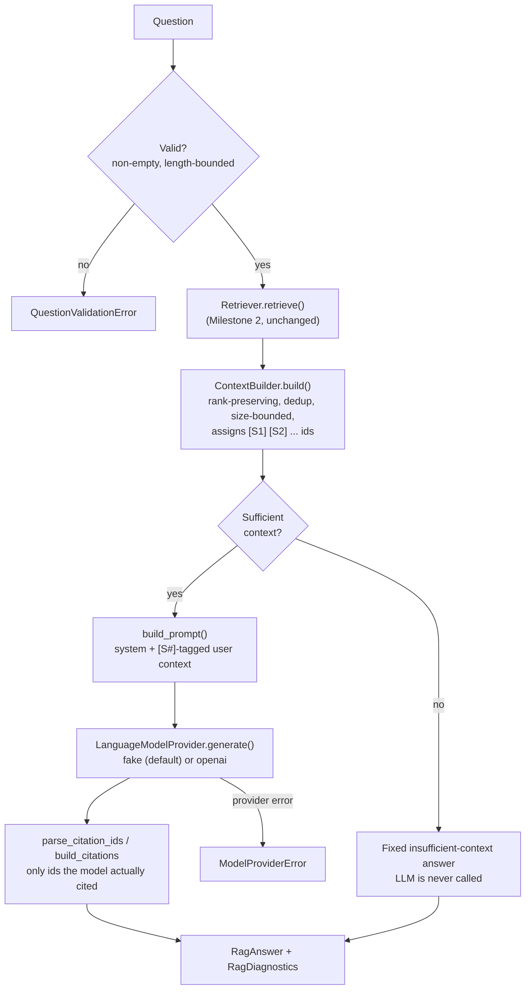

# Northstar Enterprise AI Transformation Platform

An Enterprise AI Transformation Platform being built for **Northstar Lending
Corporation** (a fictional digital lending company) on top of its Markdown
enterprise knowledge base — covering corporate strategy, business model,
architecture, and engineering standards.

The long-term platform will provide enterprise RAG, specialized engineering
advisors, architecture review support, AI governance, DevSecOps guidance,
testing/release advisors, incident response assistance, and evaluation /
observability. It is being built incrementally, milestone by milestone.

## Status

| Milestone | Scope | Status |
|---|---|---|
| **1** | Knowledge ingestion foundation | ✅ Complete |
| **2** | Semantic indexing & retrieval | ✅ Complete |
| **3** | Grounded RAG assistant (CLI) | ✅ Complete |
| **4** | Pluggable advisor framework (8 domain advisors) | ✅ Complete |
| 5+ | Advisor routing, multi-agent orchestration, UI/API | Not started |

## Milestone 1 — Knowledge Ingestion Foundation

A pipeline that discovers Northstar Markdown documents, loads them safely,
extracts metadata, and splits them into Markdown-aware chunks — producing
structured output ready for a future embedding/vector-store step. No LLM
calls, embeddings, vector DB, RAG, or agent logic are included yet.

```
enterprise_knowledge_base/*.md
        │
        ▼
DocumentDiscoveryService   (app/ingestion/document_loader.py)
        │  recursively finds *.md, skips hidden/generated files, deterministic order
        ▼
MarkdownLoader              (app/ingestion/markdown_loader.py)
        │  UTF-8 read, content hash, mtime, per-file error isolation
        ▼
metadata_extractor          (app/ingestion/metadata_extractor.py)
        │  YAML frontmatter + heading structure
        ▼
MarkdownChunker              (app/embeddings/chunking.py)
        │  heading-aware segmentation, small-fragment merge, size/overlap split
        ▼
IngestionPipeline            (app/ingestion/pipeline.py)
        │  orchestrates the above, persists artifacts
        ▼
data/processed/{chunks.jsonl, errors.json, summary.json}
```

### Setup

```bash
python -m venv .venv
.venv\Scripts\activate            # Windows
pip install -r requirements-dev.txt
cp .env.example .env               # adjust if needed; defaults work out of the box
```

### Run the pipeline

```bash
python -m app.ingestion.pipeline
```

This scans `enterprise_knowledge_base/` and writes chunked output to
`data/processed/` (git-ignored — regenerate locally rather than committing it).

Last verified run: **42 files discovered, 0 load errors, 820 chunks produced.**

### Run the tests

```bash
python -m pytest
```

69 tests cover configuration validation, discovery, loading, metadata
extraction, chunking, the end-to-end ingestion pipeline (Milestone 1),
plus the embedding provider, vector store, incremental indexer, and
retriever (Milestone 2). All Milestone 2 tests use the local embedding
provider — no network calls, no API key required. (58 further Milestone 3
tests and 53 further Milestone 4 advisor tests are described below —
182 total.)

### Configuration

All settings are environment-driven (see `.env.example`), loaded via
`app/config/settings.py::IngestionSettings.from_env()`, and validated eagerly
with clear errors on invalid/missing paths:

| Variable | Default | Meaning |
|---|---|---|
| `KNOWLEDGE_BASE_DIRS` | `enterprise_knowledge_base` | Comma-separated dirs to scan |
| `SUPPORTED_EXTENSIONS` | `.md` | Comma-separated file extensions |
| `CHUNK_SIZE` | `1500` | Max chunk length, in characters |
| `CHUNK_OVERLAP` | `200` | Overlap between split chunks, in characters |
| `LOG_LEVEL` | `INFO` | Logging verbosity |
| `INGESTION_OUTPUT_DIR` | `data/processed` | Where artifacts are written |

### Chunk output shape

```json
{
  "chunk_id": "fed3614a19ef2633",
  "text": "chunk content...",
  "chunk_index": 17,
  "document_title": "Northstar Lending Corporation - Incident Management Standard",
  "document_id": "NLC-ENG-007",
  "source_file": "16_Incident_Management.md",
  "source_path": "04_Engineering/16_Incident_Management.md",
  "section_title": "10. Major Incident Management",
  "heading_path": ["10. Major Incident Management"],
  "content_hash": "610b8bc5...",
  "char_count": 462
}
```

## Milestone 2 — Semantic Indexing & Retrieval

Embeds Milestone 1's chunks, stores them in a persistent local vector
store, keeps that index in sync as documents change, and retrieves the
most relevant chunks for a question — with diagnostics, so retrieval
quality can be checked before any LLM is introduced. No answer
generation, agents, advisor routing, API, UI, or conversation memory.

```
Chunk (Milestone 1)
        │
        ▼
EmbeddingProvider            (app/embeddings/vectorizer.py, openai_provider.py)
        │  local (default, offline) or openai — same interface either way
        ▼
Indexer                      (app/embeddings/indexer.py)
        │  incremental sync: content-addressed chunk_id set-diff (add/remove/skip-unchanged)
        ▼
VectorStore                  (app/embeddings/vector_store.py)
        │  numpy + JSON, persisted to vector_store/
        ▼
Retriever                    (app/rag/retriever.py)
        │  embeds a question, searches the store, ranks + returns diagnostics
        ▼
RetrievalResponse  (results + diagnostics)
```

### Embedding providers

Both implement the same `EmbeddingProvider` protocol
(`app/embeddings/vectorizer.py`); nothing outside `app/embeddings/`
imports a vendor SDK directly.

- **`local`** (default) — `LocalHashingEmbeddingProvider`: dependency-free,
  fully offline, deterministic signed feature hashing over word tokens
  (a lightweight bag-of-words / TF retriever via cosine similarity). No
  API key needed; this is what the test suite and CI use.
- **`openai`** — `OpenAIEmbeddingProvider`: real semantic embeddings via
  the OpenAI embeddings API. Only imports the `openai` package (`pip
  install openai`) when actually selected; requires `OPENAI_API_KEY`.

### Run the indexer

```bash
python -m app.rag.index
```

(`app.rag.index` is a thin alias for `app.embeddings.indexer` — both work;
`app.rag.index` is the canonical command since Milestone 3, keeping all
user-facing RAG commands under one namespace: `app.rag.index` /
`app.rag.ask` / `app.rag.evaluate`.)

Runs the Milestone 1 pipeline in-process, then syncs the vector store:
new/changed chunks are embedded and upserted, chunks for removed/edited
content are deleted, unchanged chunks are skipped (no re-embedding
cost). Verified against the real knowledge base: **820/820 chunks
indexed**; re-running with no source changes reports `added=0,
removed=0, unchanged=820`.

### Query the index

```bash
python -m app.rag.retriever "What is the target response time for a Sev1 incident?" --top-k 5
```

Prints ranked results (score, source file, heading path, text preview)
plus diagnostics (provider/model, index size, embed/search latency).
Confirmed against representative Northstar questions — e.g. an
incident-severity question surfaces `16_Incident_Management.md`, a
lending-product question surfaces `02_Business/05_Lending_Business_Model.md`
and `06_Loan_Lifecycle.md`.

### Configuration additions

| Variable | Default | Meaning |
|---|---|---|
| `EMBEDDING_PROVIDER` | `local` | `local` or `openai` |
| `EMBEDDING_MODEL` | provider-specific | `local-hashing-v1` (local) / `text-embedding-3-small` (openai) |
| `EMBEDDING_DIMENSIONS` | `512` | Vector dimensionality |
| `VECTOR_STORE_DIR` | `vector_store` | Where the persistent index is written |
| `RETRIEVAL_TOP_K` | `5` | Default results per query |
| `OPENAI_API_KEY` | — | Required only when `EMBEDDING_PROVIDER=openai` |

Validated eagerly by `RetrievalSettings.from_env()` in the same
`app/config/settings.py`, alongside (and independent of)
`IngestionSettings`.

## Milestone 3 — Grounded Enterprise RAG Assistant (CLI)

The first working question-answering workflow: retrieve → bound the
context → prompt → call a language model → parse citations → return a
typed, diagnosable answer — with explicit insufficient-context handling
so the assistant never invents Northstar policy. **This is a portfolio
reference implementation, not a production compliance tool** — see
Limitations and Security below. No specialized advisors, agent routing,
UI, or autonomous actions.



### Language model providers

Both implement the same `LanguageModelProvider` protocol
(`app/services/llm_service.py`); nothing outside `app/services/` imports
a vendor SDK directly.

- **`fake`** (default) — `FakeModelProvider`: dependency-free, fully
  offline, deterministic. Cites whichever `[S#]` markers appear in the
  prompt so the citation pipeline is exercisable end-to-end without any
  network call or API key. Its answers are clearly non-real placeholder
  text — use it to validate retrieval/context/citation mechanics, not
  answer quality.
- **`openai`** — `OpenAIModelProvider`: real grounded answers via the
  OpenAI Chat Completions API (same `openai` package already optional for
  Milestone 2's embedding provider). Requires `LLM_API_KEY`.

### Configure credentials

```bash
cp .env.example .env
# For real grounded answers:
#   LLM_PROVIDER=openai
#   LLM_API_KEY=sk-...
# (embeddings can independently use EMBEDDING_PROVIDER=local or =openai
#  with its own OPENAI_API_KEY — the two providers are decoupled)
```

### Run it end to end

```bash
pytest                                # run the full test suite
python -m app.rag.index               # discover + chunk + embed + index
python -m app.rag.ask "How should a Sev-1 incident be handled?"
python -m app.rag.ask "How should a Sev-1 incident be handled?" --show-diagnostics
python -m app.rag.ask "What is Northstar's current stock price?"  # insufficient-context
python -m app.rag.evaluate            # run the seed evaluation suite
```

Useful flags: `--top-k`, `--min-score`, `--model`, `--show-context`,
`--show-diagnostics`, `--show-prompts` (never exposes secrets — only the
rendered system/user prompt text), `--source-file`, `--document-id`.

### How citations work

The system prompt instructs the model to cite claims inline as `[S1]`,
`[S2]`, ... matching the numbered sources it was given.
`app/rag/citation_engine.py` then deterministically parses those markers
out of the answer text, drops duplicates (keeping first use), and — this
is the important part — **only returns a `Citation` for ids the model
actually cited**. An id that was retrieved but never referenced doesn't
appear; an id the model hallucinates (e.g. `[S12]` when only `[S1]`–`[S3]`
existed) is dropped and recorded as a warning, never fabricated into a
`Citation`.

### How insufficient context is handled

`ContextBuilder` classifies sufficiency from the *raw retrieval results*
— no results, best score below threshold, or nothing usable after
filtering — **before** any prompt is built. When insufficient, the
language model is never called; the CLI prints a fixed message stating
that the knowledge base didn't have enough information, along with how
many chunks were searched, how many were retrieved, and the highest
relevance score.

### Diagnostics

`--show-diagnostics` prints `RagDiagnostics`: request id, retrieval/embed/
search timings, retrieved vs. context chunk counts, exclusions, highest
score, model provider/name/latency, token usage, prompt version, and
total duration. Not shown by default to keep normal output readable.

### Run the tests

```bash
python -m pytest
```

182 tests total (69 from Milestones 1–2 + 58 from Milestone 3 + 53 from
Milestone 4, all unchanged/additive). All Milestone 3 tests use
`FakeModelProvider`; `OpenAIModelProvider` is
tested by injecting a fake `openai` module into `sys.modules`, exercising
the real request-building/retry/error-translation logic with zero
network calls and no installed SDK required.

### Run the evaluation

```bash
python -m app.rag.evaluate
```

(alias for `app.evaluation.rag_evaluator`, kept alongside it for
completeness in the `app.rag.*` command surface.)

Checks ~14 seed questions (`data/evaluation_sets/milestone3_eval.json`)
against a real `RagService`: whether the expected document was
retrievable, whether citations were produced, whether sufficient-context
classification matched expectations, and whether required concepts
appear in the answer. Deterministic checks only — no LLM-as-judge.

### Sample output (real `LLM_PROVIDER=openai`, `--top-k 3 --show-context`)

```
Question:
What controls are required before deploying AI-generated code?

Answer:
AI-generated code must meet the same engineering standards as
manually written code — readable, maintainable, modular, secure,
testable, and documented — and must never be merged without human
review. [S1]

Recommended Actions
- Route AI-generated changes through the standard code review process
  before merge. [S1]

Risks or Considerations
- The context does not specify additional AI-specific approval gates
  beyond standard review; confirm current policy with Engineering
  leadership before relying on this for a compliance decision.

Sources:
1. Northstar Lending Corporation - AI Engineering Standards — 16. AI-Generated Code Standards
   File: 04_Engineering/12_AI_Engineering_Standards.md
   Score: 0.42
```

### Sample output (insufficient context, any provider)

```
Question:
What is Northstar's current stock price?

Answer:
I could not find enough information in the Northstar knowledge base to answer this reliably.

The most relevant documents found were not closely related to this question.
Documents searched: 820 indexed chunks. Retrieved results: 5. Highest relevance score: 0.226.
Consider rephrasing the question with more specific Northstar terminology. This response is
based solely on the Northstar knowledge base; general industry guidance was not used.
```

### Configuration additions

| Variable | Default | Meaning |
|---|---|---|
| `LLM_PROVIDER` | `fake` | `fake` (offline) or `openai` |
| `LLM_MODEL` | provider-specific | `gpt-4o-mini` for `openai` |
| `LLM_API_KEY` | — | Required only when `LLM_PROVIDER=openai`; independent of `OPENAI_API_KEY` used for embeddings |
| `LLM_TEMPERATURE` | `0` | Sampling temperature |
| `LLM_MAX_OUTPUT_TOKENS` | `1024` | Bounds model output size |
| `LLM_TIMEOUT_SECONDS` | `30` | Per-call timeout |
| `CONTEXT_MAX_CHARACTERS` | `6000` | Character-based context budget (not token-based — providers tokenize differently; documented limitation) |
| `CONTEXT_MAX_CHUNKS` | `6` | Max chunks included in context |
| `CONTEXT_MIN_SCORE` | `0.1` | Minimum retrieval score to include a chunk in context |
| `MAX_QUESTION_LENGTH` | `2000` | Guardrail: rejects oversized questions before retrieval |
| `INSUFFICIENT_CONTEXT_MIN_RESULTS` | `1` | Below this many retrieval results → insufficient |
| `INSUFFICIENT_CONTEXT_MIN_SCORE` | `0.15` | Below this top score → insufficient |

### Limitations

- **The default `local` embedding provider (Milestone 2) is lexical, not
  semantic**, and this directly limits Milestone 3's insufficient-context
  detection: a signed-hashing bag-of-words embedding gives even
  topically-unrelated questions (e.g. "Who is the CEO of Northstar in
  real life?") a nontrivial score purely from shared vocabulary
  ("Northstar") and short-vector hash-collision noise, so the default
  threshold does not reliably distinguish "irrelevant" from "relevant" —
  confirmed via `python -m app.rag.evaluate` (both
  insufficient-context seed cases misclassified as sufficient under
  `EMBEDDING_PROVIDER=local`). This is expected to improve substantially
  with `EMBEDDING_PROVIDER=openai`'s real semantic embeddings; it was not
  "fixed" by tuning thresholds against the weak baseline, per the
  milestone's own guidance to keep the threshold logic simple.
- Context construction is character-bounded, not token-bounded — a
  reasonable proxy, but not exact for any specific provider's tokenizer.
- Citation validation is syntactic only (does the `[S#]` exist and match
  a supplied source) — there is no semantic check that the cited source
  actually supports the adjacent claim.
- `FakeModelProvider`'s answers are placeholder text; concept/quality
  checks in the evaluator are only meaningful with a real provider.

### Security considerations

- Retrieved document text is explicitly framed as **untrusted data** in
  the system prompt; embedded instructions in a document are treated as
  content to describe, never as commands (see `test_guardrails.py`).
- No shell execution, infrastructure changes, or other production actions
  are triggered by any model output — this milestone is read-only
  question answering.
- API keys are never logged (verified in tests at INFO level); `.env` is
  git-ignored; `--show-prompts` reveals prompt text only, never secrets.
- The assistant is explicitly instructed not to claim legal, regulatory,
  security, or production-readiness approval, and to preserve human
  accountability for every recommendation.
- **Users must review AI-generated recommendations** — this system
  produces a grounded draft, not an authoritative decision.

### Next milestone

See Milestone 4 below — it delivers the specialized advisors this
section originally flagged as future work.

## Milestone 4 — Pluggable Advisor Framework

Eight domain advisors, each a **thin, declarative specialization** over
the exact same `RagService` from Milestone 3 — a persona, optional
default retrieval filters, and a response structure/extra guidance
layered on top of the same shared grounding guardrails every advisor
gets for free. **No changes to ingestion, indexing, retrieval, citation
parsing, or evaluation** — verified by keeping the entire Milestone 1–3
test suite green and the plain (no-advisor) CLI path byte-identical to
Milestone 3's output. No advisor routing, multi-agent orchestration, UI,
or workflow automation — advisor selection is manual, via `--advisor`.

| Advisor | id | Default filter | Why |
|---|---|---|---|
| Architecture | `architecture` | `NLC-ENG-002` | Single well-populated source doc |
| AI Engineering | `ai-engineering` | `NLC-ENG-003` | Single well-populated source doc |
| DevSecOps | `devsecops` | `NLC-ENG-004` | Single well-populated source doc |
| Testing | `testing` | `NLC-ENG-005` | Single well-populated source doc |
| Platform Engineering | `platform-engineering` | `NLC-ENG-008` | Single well-populated source doc |
| Incident Management | `incident-management` | `NLC-ENG-007` | Single well-populated source doc |
| Security | `security` | *(none)* | Cross-cutting: spans DevSecOps + AI Engineering's AI Security section; `Security_Architecture.md` is an empty placeholder |
| Executive AI Transformation | `executive-ai-transformation` | *(none)* | Cross-cutting: "AI Transformation Perspective" content is repeated across many documents |

### How it works

```
Advisor (persona, structure, extra guidance, default filters)
        │
        ▼
build_system_prompt(persona, GROUNDING_GUARDRAILS, extra_guidance, structure)
        │  (app/config/prompt_config.py — same shared guardrails for every advisor)
        ▼
Advisor.ask(service, question, filters=...)
        │  merges default_filters with any caller-supplied filters (caller wins)
        ▼
RagService.ask(question, filters=merged, system_prompt=..., prompt_version=...)
        │  (app/rag/pipeline.py — UNCHANGED Milestone 3 orchestration)
        ▼
RagAnswer (diagnostics.prompt_version = "rag-system-v1+<advisor-id>-v1")
```

The only edits to Milestone 1–3 files are two purely-additive, optional
kwargs: `build_prompt(..., system_prompt=None, prompt_version=None)` and
`RagService.ask(..., system_prompt=None, prompt_version=None)` — every
existing call site omits both, so nothing about retrieval, context
construction, generation, or citation parsing changed.

### CLI

```bash
python -m app.rag.ask --list-advisors
python -m app.rag.ask "What testing evidence is required before release?" --advisor testing --show-diagnostics
python -m app.rag.ask "What AI security controls does Northstar require?" --advisor security
```

### Sample output (`--advisor testing`)

```
Advisor: Testing Advisor

Question:
What testing evidence is required before release?

Answer:
This is a deterministic fake response for local testing. [S1] [S2]

Sources:
1. Northstar Lending Corporation - Testing Strategy — 35. Compliance Testing
   File: 04_Engineering/14_Testing_Strategy.md
   Score: 0.27
2. Northstar Lending Corporation - Testing Strategy — 3. Vision
   File: 04_Engineering/14_Testing_Strategy.md
   Score: 0.27
```

Confirmed: retrieval is scoped to `14_Testing_Strategy.md` only, and
`--show-diagnostics` shows `prompt_version: rag-system-v1+testing-v1`.
The unfiltered Security advisor, asked "What AI security controls does
Northstar require?", correctly pulled from **both**
`12_AI_Engineering_Standards.md` (§24 AI Security Standards) and
`13_DevSecOps_Standards.md` — exactly the cross-document behavior its
lack of a default filter is meant to enable.

### Adding a 9th advisor

1. Create `app/agents/<name>_advisor.py` exporting `ADVISOR = Advisor(...)`.
2. Add one line to `app/agents/registry.py`.
3. No other file changes required — the CLI and `--list-advisors` pick
   it up automatically.

### Tests

`tests/test_advisors.py` (prompt composition, registry, per-advisor
structural checks, filter-merging in isolation) and
`tests/test_advisor_integration.py` (end-to-end with `FakeModelProvider`:
a filtered advisor only retrieves its own document, an unfiltered one
retrieves across documents, a filtered advisor with no matching document
correctly reports insufficient context rather than fabricating, and the
plain no-advisor path is unaffected). 182 tests total.

### Next milestone

Advisor routing (automatically picking an advisor for a question),
multi-agent orchestration, an evaluation harness that scores advisor
answers specifically, and — only if it fits naturally — a thin API
layer are still not implemented.

## Project layout

```
app/
  config/       settings.py (Ingestion/Retrieval/RagSettings), logging.py,
                prompt_config.py                                 — M1 + M2 + M3 (+ M4: build_system_prompt)
  models/       document.py, chunk.py, query.py,
                response.py (+ RagAnswer/RagDiagnostics),
                citation.py                                      — M1 + M2 + M3 (pydantic)
  ingestion/    document_loader.py, markdown_loader.py,
                metadata_extractor.py, pipeline.py               — Milestone 1
  embeddings/   chunking.py                                      — Milestone 1
                vectorizer.py, openai_provider.py,
                vector_store.py, indexer.py                      — Milestone 2
                (emdedding_service.py, reranker.py are future-milestone placeholders)
  rag/          retriever.py                                     — Milestone 2
                context_builder.py, citation_engine.py, pipeline.py,
                ask.py                                            — Milestone 3
                (generator.py, hybrid_search.py stay empty: model invocation
                is already a full concern via LanguageModelProvider, and
                hybrid search is out of scope)
  services/     llm_service.py, openai_llm_provider.py            — Milestone 3
                (document_service.py, embedding_service.py,
                logging_service.py, vector_service.py are placeholders)
  evaluation/   rag_evaluator.py                                  — Milestone 3
                (benchmark_runner.py, llm_judge.py, retrieval_metrics.py,
                sample_questions.py are future-milestone placeholders)
  agents/       base_agent.py (Advisor), registry.py,
                architecture_advisor.py, ai_engineering_advisor.py,
                devsecops_advisor.py, testing_advisor.py,
                security_advisor.py, platform_advisor.py,
                incident_advisor.py, ai_transformation_advisor.py  — Milestone 4
                (business_advisor.py, engineering_advisor.py, orcherstrator.py
                stay empty: not one of the 8 advisors / routing is out of scope)
  api/, telemetry/, ...                                            — placeholders for later milestones
enterprise_knowledge_base/   Northstar's Markdown knowledge base (source data)
data/processed/               generated ingestion artifacts (git-ignored)
data/evaluation_sets/         Milestone 3 seed evaluation dataset
vector_store/                  generated embeddings + index (git-ignored)
tests/                         pytest suite
```

Everything not listed above as M1/M2/M3/M4 is intentionally still an
empty placeholder — scaffolding for milestones that haven't been built yet.
