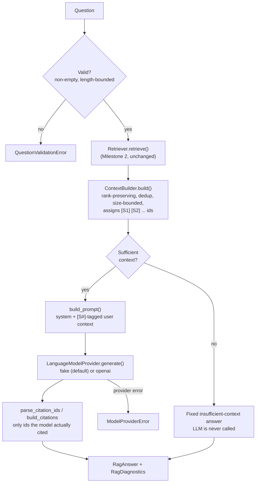

# Northstar Enterprise AI Transformation Platform

An Enterprise AI Transformation Platform being built for **Northstar Lending
Corporation** (a fictional digital lending company) on top of its Markdown
enterprise knowledge base — covering corporate strategy, business model,
architecture, and engineering standards.

The long-term platform will provide enterprise RAG, specialized engineering
advisors, architecture review support, AI governance, DevSecOps guidance,
testing/release advisors, incident response assistance, and evaluation /
observability. It is being built incrementally, milestone by milestone.

## Status

| Milestone | Scope | Status |
|---|---|---|
| **1** | Knowledge ingestion foundation | ✅ Complete |
| **2** | Semantic indexing & retrieval | ✅ Complete |
| **3** | Grounded RAG assistant (CLI) | ✅ Complete |
| **4** | Pluggable advisor framework (10 domain advisors) | ✅ Complete |
| **5** | Advisor router & controlled multi-advisor synthesis | ✅ Complete |
| **6** | Enterprise workflow orchestration (5 review workflows) | ✅ Complete |
| 7+ | UI/API, evaluation of advisor/workflow answer quality beyond deterministic checks | Not started |

## Milestone 1 — Knowledge Ingestion Foundation

A pipeline that discovers Northstar Markdown documents, loads them safely,
extracts metadata, and splits them into Markdown-aware chunks — producing
structured output ready for a future embedding/vector-store step. No LLM
calls, embeddings, vector DB, RAG, or agent logic are included yet.

```
enterprise_knowledge_base/*.md
        │
        ▼
DocumentDiscoveryService   (app/ingestion/document_loader.py)
        │  recursively finds *.md, skips hidden/generated files, deterministic order
        ▼
MarkdownLoader              (app/ingestion/markdown_loader.py)
        │  UTF-8 read, content hash, mtime, per-file error isolation
        ▼
metadata_extractor          (app/ingestion/metadata_extractor.py)
        │  YAML frontmatter + heading structure
        ▼
MarkdownChunker              (app/embeddings/chunking.py)
        │  heading-aware segmentation, small-fragment merge, size/overlap split
        ▼
IngestionPipeline            (app/ingestion/pipeline.py)
        │  orchestrates the above, persists artifacts
        ▼
data/processed/{chunks.jsonl, errors.json, summary.json}
```

### Setup

```bash
python -m venv .venv
.venv\Scripts\activate            # Windows
pip install -r requirements-dev.txt
cp .env.example .env               # adjust if needed; defaults work out of the box
```

### Run the pipeline

```bash
python -m app.ingestion.pipeline
```

This scans `enterprise_knowledge_base/` and writes chunked output to
`data/processed/` (git-ignored — regenerate locally rather than committing it).

Last verified run: **42 files discovered, 0 load errors, 820 chunks produced.**

### Run the tests

```bash
python -m pytest
```

69 tests cover configuration validation, discovery, loading, metadata
extraction, chunking, the end-to-end ingestion pipeline (Milestone 1),
plus the embedding provider, vector store, incremental indexer, and
retriever (Milestone 2). All Milestone 2 tests use the local embedding
provider — no network calls, no API key required. (58 further Milestone 3
tests, 53 further Milestone 4 advisor tests, 32 further Milestone 5
router/orchestrator tests, and 103 further Milestone 6 workflow tests
are described below — 317 total.)

### Configuration

All settings are environment-driven (see `.env.example`), loaded via
`app/config/settings.py::IngestionSettings.from_env()`, and validated eagerly
with clear errors on invalid/missing paths:

| Variable | Default | Meaning |
|---|---|---|
| `KNOWLEDGE_BASE_DIRS` | `enterprise_knowledge_base` | Comma-separated dirs to scan |
| `SUPPORTED_EXTENSIONS` | `.md` | Comma-separated file extensions |
| `CHUNK_SIZE` | `1500` | Max chunk length, in characters |
| `CHUNK_OVERLAP` | `200` | Overlap between split chunks, in characters |
| `LOG_LEVEL` | `INFO` | Logging verbosity |
| `INGESTION_OUTPUT_DIR` | `data/processed` | Where artifacts are written |

### Chunk output shape

```json
{
  "chunk_id": "fed3614a19ef2633",
  "text": "chunk content...",
  "chunk_index": 17,
  "document_title": "Northstar Lending Corporation - Incident Management Standard",
  "document_id": "NLC-ENG-007",
  "source_file": "16_Incident_Management.md",
  "source_path": "04_Engineering/16_Incident_Management.md",
  "section_title": "10. Major Incident Management",
  "heading_path": ["10. Major Incident Management"],
  "content_hash": "610b8bc5...",
  "char_count": 462
}
```

## Milestone 2 — Semantic Indexing & Retrieval

Embeds Milestone 1's chunks, stores them in a persistent local vector
store, keeps that index in sync as documents change, and retrieves the
most relevant chunks for a question — with diagnostics, so retrieval
quality can be checked before any LLM is introduced. No answer
generation, agents, advisor routing, API, UI, or conversation memory.

```
Chunk (Milestone 1)
        │
        ▼
EmbeddingProvider            (app/embeddings/vectorizer.py, openai_provider.py)
        │  local (default, offline) or openai — same interface either way
        ▼
Indexer                      (app/embeddings/indexer.py)
        │  incremental sync: content-addressed chunk_id set-diff (add/remove/skip-unchanged)
        ▼
VectorStore                  (app/embeddings/vector_store.py)
        │  numpy + JSON, persisted to vector_store/
        ▼
Retriever                    (app/rag/retriever.py)
        │  embeds a question, searches the store, ranks + returns diagnostics
        ▼
RetrievalResponse  (results + diagnostics)
```

### Embedding providers

Both implement the same `EmbeddingProvider` protocol
(`app/embeddings/vectorizer.py`); nothing outside `app/embeddings/`
imports a vendor SDK directly.

- **`local`** (default) — `LocalHashingEmbeddingProvider`: dependency-free,
  fully offline, deterministic signed feature hashing over word tokens
  (a lightweight bag-of-words / TF retriever via cosine similarity). No
  API key needed; this is what the test suite and CI use.
- **`openai`** — `OpenAIEmbeddingProvider`: real semantic embeddings via
  the OpenAI embeddings API. Only imports the `openai` package (`pip
  install openai`) when actually selected; requires `OPENAI_API_KEY`.

### Run the indexer

```bash
python -m app.rag.index
```

(`app.rag.index` is a thin alias for `app.embeddings.indexer` — both work;
`app.rag.index` is the canonical command since Milestone 3, keeping all
user-facing RAG commands under one namespace: `app.rag.index` /
`app.rag.ask` / `app.rag.evaluate`.)

Runs the Milestone 1 pipeline in-process, then syncs the vector store:
new/changed chunks are embedded and upserted, chunks for removed/edited
content are deleted, unchanged chunks are skipped (no re-embedding
cost). Verified against the real knowledge base: **820/820 chunks
indexed**; re-running with no source changes reports `added=0,
removed=0, unchanged=820`.

### Query the index

```bash
python -m app.rag.retriever "What is the target response time for a Sev1 incident?" --top-k 5
```

Prints ranked results (score, source file, heading path, text preview)
plus diagnostics (provider/model, index size, embed/search latency).
Confirmed against representative Northstar questions — e.g. an
incident-severity question surfaces `16_Incident_Management.md`, a
lending-product question surfaces `02_Business/05_Lending_Business_Model.md`
and `06_Loan_Lifecycle.md`.

### Configuration additions

| Variable | Default | Meaning |
|---|---|---|
| `EMBEDDING_PROVIDER` | `local` | `local` or `openai` |
| `EMBEDDING_MODEL` | provider-specific | `local-hashing-v1` (local) / `text-embedding-3-small` (openai) |
| `EMBEDDING_DIMENSIONS` | `512` | Vector dimensionality |
| `VECTOR_STORE_DIR` | `vector_store` | Where the persistent index is written |
| `RETRIEVAL_TOP_K` | `5` | Default results per query |
| `OPENAI_API_KEY` | — | Required only when `EMBEDDING_PROVIDER=openai` |

Validated eagerly by `RetrievalSettings.from_env()` in the same
`app/config/settings.py`, alongside (and independent of)
`IngestionSettings`.

## Milestone 3 — Grounded Enterprise RAG Assistant (CLI)

The first working question-answering workflow: retrieve → bound the
context → prompt → call a language model → parse citations → return a
typed, diagnosable answer — with explicit insufficient-context handling
so the assistant never invents Northstar policy. **This is a portfolio
reference implementation, not a production compliance tool** — see
Limitations and Security below. No specialized advisors, agent routing,
UI, or autonomous actions.



### Language model providers

Both implement the same `LanguageModelProvider` protocol
(`app/services/llm_service.py`); nothing outside `app/services/` imports
a vendor SDK directly.

- **`fake`** (default) — `FakeModelProvider`: dependency-free, fully
  offline, deterministic. Cites whichever `[S#]` markers appear in the
  prompt so the citation pipeline is exercisable end-to-end without any
  network call or API key. Its answers are clearly non-real placeholder
  text — use it to validate retrieval/context/citation mechanics, not
  answer quality.
- **`openai`** — `OpenAIModelProvider`: real grounded answers via the
  OpenAI Chat Completions API (same `openai` package already optional for
  Milestone 2's embedding provider). Requires `LLM_API_KEY`.

### Configure credentials

```bash
cp .env.example .env
# For real grounded answers:
#   LLM_PROVIDER=openai
#   LLM_API_KEY=sk-...
# (embeddings can independently use EMBEDDING_PROVIDER=local or =openai
#  with its own OPENAI_API_KEY — the two providers are decoupled)
```

### Run it end to end

```bash
pytest                                # run the full test suite
python -m app.rag.index               # discover + chunk + embed + index
python -m app.rag.ask "How should a Sev-1 incident be handled?"
python -m app.rag.ask "How should a Sev-1 incident be handled?" --show-diagnostics
python -m app.rag.ask "What is Northstar's current stock price?"  # insufficient-context
python -m app.rag.evaluate            # run the seed evaluation suite
```

Useful flags: `--top-k`, `--min-score`, `--model`, `--show-context`,
`--show-diagnostics`, `--show-prompts` (never exposes secrets — only the
rendered system/user prompt text), `--source-file`, `--document-id`.

### How citations work

The system prompt instructs the model to cite claims inline as `[S1]`,
`[S2]`, ... matching the numbered sources it was given.
`app/rag/citation_engine.py` then deterministically parses those markers
out of the answer text, drops duplicates (keeping first use), and — this
is the important part — **only returns a `Citation` for ids the model
actually cited**. An id that was retrieved but never referenced doesn't
appear; an id the model hallucinates (e.g. `[S12]` when only `[S1]`–`[S3]`
existed) is dropped and recorded as a warning, never fabricated into a
`Citation`.

### How insufficient context is handled

`ContextBuilder` classifies sufficiency from the *raw retrieval results*
— no results, best score below threshold, or nothing usable after
filtering — **before** any prompt is built. When insufficient, the
language model is never called; the CLI prints a fixed message stating
that the knowledge base didn't have enough information, along with how
many chunks were searched, how many were retrieved, and the highest
relevance score.

### Diagnostics

`--show-diagnostics` prints `RagDiagnostics`: request id, retrieval/embed/
search timings, retrieved vs. context chunk counts, exclusions, highest
score, model provider/name/latency, token usage, prompt version, and
total duration. Not shown by default to keep normal output readable.

### Run the tests

```bash
python -m pytest
```

317 tests total (69 from Milestones 1–2 + 58 from Milestone 3 + 53 from
Milestone 4 + 32 from Milestone 5 + 103 from Milestone 6, all
unchanged/additive). All Milestone 3 tests use `FakeModelProvider`;
`OpenAIModelProvider` is tested by injecting a fake `openai` module into
`sys.modules`, exercising
the real request-building/retry/error-translation logic with zero
network calls and no installed SDK required.

### Run the evaluation

```bash
python -m app.rag.evaluate
```

(alias for `app.evaluation.rag_evaluator`, kept alongside it for
completeness in the `app.rag.*` command surface.)

Checks ~14 seed questions (`data/evaluation_sets/milestone3_eval.json`)
against a real `RagService`: whether the expected document was
retrievable, whether citations were produced, whether sufficient-context
classification matched expectations, and whether required concepts
appear in the answer. Deterministic checks only — no LLM-as-judge.

### Sample output (real `LLM_PROVIDER=openai`, `--top-k 3 --show-context`)

```
Question:
What controls are required before deploying AI-generated code?

Answer:
AI-generated code must meet the same engineering standards as
manually written code — readable, maintainable, modular, secure,
testable, and documented — and must never be merged without human
review. [S1]

Recommended Actions
- Route AI-generated changes through the standard code review process
  before merge. [S1]

Risks or Considerations
- The context does not specify additional AI-specific approval gates
  beyond standard review; confirm current policy with Engineering
  leadership before relying on this for a compliance decision.

Sources:
1. Northstar Lending Corporation - AI Engineering Standards — 16. AI-Generated Code Standards
   File: 04_Engineering/12_AI_Engineering_Standards.md
   Score: 0.42
```

### Sample output (insufficient context, any provider)

```
Question:
What is Northstar's current stock price?

Answer:
I could not find enough information in the Northstar knowledge base to answer this reliably.

The most relevant documents found were not closely related to this question.
Documents searched: 820 indexed chunks. Retrieved results: 5. Highest relevance score: 0.226.
Consider rephrasing the question with more specific Northstar terminology. This response is
based solely on the Northstar knowledge base; general industry guidance was not used.
```

### Configuration additions

| Variable | Default | Meaning |
|---|---|---|
| `LLM_PROVIDER` | `fake` | `fake` (offline) or `openai` |
| `LLM_MODEL` | provider-specific | `gpt-4o-mini` for `openai` |
| `LLM_API_KEY` | — | Required only when `LLM_PROVIDER=openai`; independent of `OPENAI_API_KEY` used for embeddings |
| `LLM_TEMPERATURE` | `0` | Sampling temperature |
| `LLM_MAX_OUTPUT_TOKENS` | `1024` | Bounds model output size |
| `LLM_TIMEOUT_SECONDS` | `30` | Per-call timeout |
| `CONTEXT_MAX_CHARACTERS` | `6000` | Character-based context budget (not token-based — providers tokenize differently; documented limitation) |
| `CONTEXT_MAX_CHUNKS` | `6` | Max chunks included in context |
| `CONTEXT_MIN_SCORE` | `0.1` | Minimum retrieval score to include a chunk in context |
| `MAX_QUESTION_LENGTH` | `2000` | Guardrail: rejects oversized questions before retrieval |
| `INSUFFICIENT_CONTEXT_MIN_RESULTS` | `1` | Below this many retrieval results → insufficient |
| `INSUFFICIENT_CONTEXT_MIN_SCORE` | `0.15` | Below this top score → insufficient |

### Limitations

- **The default `local` embedding provider (Milestone 2) is lexical, not
  semantic**, and this directly limits Milestone 3's insufficient-context
  detection: a signed-hashing bag-of-words embedding gives even
  topically-unrelated questions (e.g. "Who is the CEO of Northstar in
  real life?") a nontrivial score purely from shared vocabulary
  ("Northstar") and short-vector hash-collision noise, so the default
  threshold does not reliably distinguish "irrelevant" from "relevant" —
  confirmed via `python -m app.rag.evaluate` (both
  insufficient-context seed cases misclassified as sufficient under
  `EMBEDDING_PROVIDER=local`). This is expected to improve substantially
  with `EMBEDDING_PROVIDER=openai`'s real semantic embeddings; it was not
  "fixed" by tuning thresholds against the weak baseline, per the
  milestone's own guidance to keep the threshold logic simple.
- Context construction is character-bounded, not token-bounded — a
  reasonable proxy, but not exact for any specific provider's tokenizer.
- Citation validation is syntactic only (does the `[S#]` exist and match
  a supplied source) — there is no semantic check that the cited source
  actually supports the adjacent claim.
- `FakeModelProvider`'s answers are placeholder text; concept/quality
  checks in the evaluator are only meaningful with a real provider.

### Security considerations

- Retrieved document text is explicitly framed as **untrusted data** in
  the system prompt; embedded instructions in a document are treated as
  content to describe, never as commands (see `test_guardrails.py`).
- No shell execution, infrastructure changes, or other production actions
  are triggered by any model output — this milestone is read-only
  question answering.
- API keys are never logged (verified in tests at INFO level); `.env` is
  git-ignored; `--show-prompts` reveals prompt text only, never secrets.
- The assistant is explicitly instructed not to claim legal, regulatory,
  security, or production-readiness approval, and to preserve human
  accountability for every recommendation.
- **Users must review AI-generated recommendations** — this system
  produces a grounded draft, not an authoritative decision.

### Next milestone

See Milestone 4 below — it delivers the specialized advisors this
section originally flagged as future work.

## Milestone 4 — Pluggable Advisor Framework

Ten domain advisors, each a **thin, declarative specialization** over
the exact same `RagService` from Milestone 3 — a persona, optional
default retrieval filters, and a response structure/extra guidance
layered on top of the same shared grounding guardrails every advisor
gets for free. **No changes to ingestion, indexing, retrieval, citation
parsing, or evaluation** — verified by keeping the entire Milestone 1–3
test suite green and the plain (no-advisor) CLI path byte-identical to
Milestone 3's output. No advisor routing, multi-agent orchestration, UI,
or workflow automation — advisor selection is manual, via `--advisor`
(automatic routing arrives in Milestone 5 below).

| Advisor | id | Default filter | Why |
|---|---|---|---|
| Architecture | `architecture` | `NLC-ENG-002` | Single well-populated source doc |
| AI Engineering | `ai-engineering` | `NLC-ENG-003` | Single well-populated source doc |
| DevSecOps | `devsecops` | `NLC-ENG-004` | Single well-populated source doc |
| Testing | `testing` | `NLC-ENG-005` | Single well-populated source doc |
| Release | `release` | `NLC-ENG-006` | Single well-populated source doc |
| Incident Management | `incident-management` | `NLC-ENG-007` | Single well-populated source doc |
| Platform Engineering | `platform-engineering` | `NLC-ENG-008` | Single well-populated source doc |
| Developer Experience | `developer-experience` | `NLC-ENG-009` | Single well-populated source doc |
| Security | `security` | *(none)* | Cross-cutting: spans DevSecOps + AI Engineering's AI Security section; `Security_Architecture.md` is an empty placeholder |
| Executive AI Transformation | `executive-ai-transformation` | *(none)* | Cross-cutting: "AI Transformation Perspective" content is repeated across many documents |

### How it works

```
Advisor (persona, structure, extra guidance, default filters)
        │
        ▼
build_system_prompt(persona, GROUNDING_GUARDRAILS, extra_guidance, structure)
        │  (app/config/prompt_config.py — same shared guardrails for every advisor)
        ▼
Advisor.ask(service, question, filters=...)
        │  merges default_filters with any caller-supplied filters (caller wins)
        ▼
RagService.ask(question, filters=merged, system_prompt=..., prompt_version=...)
        │  (app/rag/pipeline.py — UNCHANGED Milestone 3 orchestration)
        ▼
RagAnswer (diagnostics.prompt_version = "rag-system-v1+<advisor-id>-v1")
```

The only edits to Milestone 1–3 files are two purely-additive, optional
kwargs: `build_prompt(..., system_prompt=None, prompt_version=None)` and
`RagService.ask(..., system_prompt=None, prompt_version=None)` — every
existing call site omits both, so nothing about retrieval, context
construction, generation, or citation parsing changed.

### CLI

```bash
python -m app.rag.ask --list-advisors
python -m app.rag.ask "What testing evidence is required before release?" --advisor testing --show-diagnostics
python -m app.rag.ask "What AI security controls does Northstar require?" --advisor security
```

### Sample output (`--advisor testing`)

```
Advisor: Testing Advisor

Question:
What testing evidence is required before release?

Answer:
This is a deterministic fake response for local testing. [S1] [S2]

Sources:
1. Northstar Lending Corporation - Testing Strategy — 35. Compliance Testing
   File: 04_Engineering/14_Testing_Strategy.md
   Score: 0.27
2. Northstar Lending Corporation - Testing Strategy — 3. Vision
   File: 04_Engineering/14_Testing_Strategy.md
   Score: 0.27
```

Confirmed: retrieval is scoped to `14_Testing_Strategy.md` only, and
`--show-diagnostics` shows `prompt_version: rag-system-v1+testing-v1`.
The unfiltered Security advisor, asked "What AI security controls does
Northstar require?", correctly pulled from **both**
`12_AI_Engineering_Standards.md` (§24 AI Security Standards) and
`13_DevSecOps_Standards.md` — exactly the cross-document behavior its
lack of a default filter is meant to enable.

### Adding an 11th advisor

1. Create `app/agents/<name>_advisor.py` exporting `ADVISOR = Advisor(...)`,
   including a non-empty `domain_keywords` tuple (used by Milestone 5's
   router — see below).
2. Add one line to `app/agents/registry.py`.
3. No other file changes required — the CLI, `--list-advisors`, and
   `--auto-route` all pick it up automatically.

### Tests

`tests/test_advisors.py` (prompt composition, registry, per-advisor
structural checks, filter-merging in isolation) and
`tests/test_advisor_integration.py` (end-to-end with `FakeModelProvider`:
a filtered advisor only retrieves its own document, an unfiltered one
retrieves across documents, a filtered advisor with no matching document
correctly reports insufficient context rather than fabricating, and the
plain no-advisor path is unaffected).

### Next milestone

See Milestone 5 below — it delivers the automatic advisor routing this
section originally flagged as future work, plus controlled multi-advisor
synthesis.

## Milestone 5 — Advisor Router & Controlled Multi-Advisor Synthesis

Automatic advisor selection and bounded multi-advisor synthesis, built
entirely on top of the unchanged Milestone 1–4 stack. **No changes to
ingestion, indexing, retrieval, citation parsing, evaluation, or any of
the 10 advisors' prompts/filters/behavior** — the only edits to existing
files are two purely-additive items: `RagService.llm` (a getter mirroring
the existing `.retriever` property) and `Advisor.domain_keywords` (an
optional tuple, defaulting to empty, that only the router reads). No
autonomous agents, recursive planning, open-ended tool use, self-directed
workflows, shell execution, or production actions — routing and synthesis
are both fixed, bounded sequences of calls into the existing RAG
pipeline, never model-directed branching.

```
Question
   │
   ▼
AdvisorRouter.route()                         (app/agents/router.py)
   │  two deterministic signals, no LLM call:
   │  - retrieval signal: one unfiltered Retriever.retrieve() call;
   │    each result's score attributed to whichever advisor's
   │    default_filters["document_id"] matches, averaged per advisor
   │    (kept on the retriever's own absolute cosine-similarity scale —
   │    never re-normalized, so an off-topic question genuinely scores lower)
   │  - keyword signal: substring match of Advisor.domain_keywords
   │    against the lowercased question, normalized 0..1 by max
   │  combined = retrieval_weight * retrieval + keyword_weight * keyword
   ▼
RoutingDecision (primary_advisor, supporting_advisors, confidence,
                 rationale, detected_domains, fallback_used)
   │
   ▼
AdvisorOrchestrator.ask()                     (app/agents/orchestrator.py)
   │  1. call primary Advisor.ask() (unchanged Milestone 4 call)
   │  2. primary insufficient context? → return immediately, no further calls
   │  3. call each supporting Advisor.ask() (unchanged Milestone 4 call)
   │  4. no supporting advisors? → return primary's answer verbatim, 0 extra LLM calls
   │  5. supporting advisors present? → exactly ONE bounded synthesis call,
   │     over already-grounded advisor answers only (never raw KB text)
   ▼
ConsolidatedAdvisorResponse (routing, primary_answer, supporting_answers,
                              answer, citations, warnings, synthesized, ...)
```

Bounded by construction: at most **1 (primary) + `ROUTER_MAX_SUPPORTING_ADVISORS`
(supporting, default 2) + 1 (synthesis) = 4 LLM calls**, always terminates,
no loop, no tool use. Citations in the final response are the union of
every advisor's own `Citation` objects, deduped by `chunk_id` — **never
re-parsed from the synthesis text**, so nothing the synthesis step writes
can fabricate a citation.

### Why routing doesn't call an LLM

The milestone's hard requirement — "deterministic, explainable, testable,
human-controlled" — ruled out an LLM classification call for routing:
identical input must always produce identical output, and the reasoning
must be inspectable without re-running a model. Both signals reuse
existing, already-tested infrastructure (`Retriever` from Milestone 2,
`domain_keywords` substring matching) rather than adding a new
dependency.

One correctness detail worth calling out: the retrieval signal is
deliberately **not** normalized to make the top-scoring advisor "1.0" —
early testing surfaced that doing so made *every* question look
confidently routable (an irrelevant question's best-matching document is
still "the best of a bad set," and max-normalizing throws away how bad
that set actually was). Keeping the signal on the retriever's own
absolute cosine-similarity scale preserves that information: a genuinely
on-topic question's best chunk scored `0.396`, an off-topic question's
best chunk scored `0.225` — different enough for `fallback_used` to
reliably distinguish the two once the confidence threshold sits between
them.

### CLI

```bash
python -m app.rag.ask "How should a Sev-1 incident be handled?" --auto-route
python -m app.rag.ask "..." --auto-route --show-diagnostics
```

`--auto-route` is mutually exclusive with `--advisor`. Output always
shows a `Routing:` block (routing is the point, so it's never hidden
behind another flag); `--show-diagnostics` additionally shows per-call
diagnostics for the primary advisor, each supporting advisor, and the
synthesis call (if one happened).

### Sample output — single clear domain (`synthesized=False`)

```
Routing:
  primary_advisor:      incident-management
  supporting_advisors:  (none)
  confidence:           0.589
  fallback_used:        False
  detected_domains:     ['Incident Management Advisor']
  rationale:            Selected 'incident-management' with combined score 0.589 (retrieval=0.316, keyword=1.000).

Question:
How should a Sev-1 incident be handled?

Answer:
...
```

### Sample output — cross-domain question (`synthesized=True`)

```
Routing:
  primary_advisor:      release
  supporting_advisors:  ['testing']
  confidence:           0.563
  fallback_used:        False
  detected_domains:     ['Release Advisor', 'Testing Advisor']
  rationale:            Selected 'release' with combined score 0.563 (retrieval=0.271, keyword=1.000).

Question:
What test coverage and release evidence is required before a canary deployment can proceed?
```

`--show-diagnostics` on this question confirms exactly one synthesis
call: `[synthesis] provider: fake  model: fake-echo-v1`.

### Sample output — unrelated question (`fallback_used=True`)

```
Routing:
  primary_advisor:      release
  supporting_advisors:  ['ai-engineering', 'incident-management']
  confidence:           0.135
  fallback_used:        True
  detected_domains:     (none)
  rationale:            Selected 'release' with combined score 0.135 (retrieval=0.225, keyword=0.000). Below minimum confidence 0.150; treating as a low-confidence fallback.

Question:
What is the best recipe for chocolate chip cookies?
```

The router still names a best-guess primary advisor (no sentinel "none"
case — simpler contract, always resolvable), just flags low confidence
for the human reading the output. The underlying (unchanged)
`RagService` insufficiency logic then handles the actual answer honestly
per-advisor, exactly as it did before this milestone.

### Configuration additions

| Variable | Default | Meaning |
|---|---|---|
| `ROUTER_RETRIEVAL_TOP_K` | `12` | Unfiltered retrieval depth used only to compute the router's retrieval signal |
| `ROUTER_MIN_CONFIDENCE` | `0.15` | Below this combined score, `fallback_used=True` |
| `ROUTER_SUPPORTING_MIN_RATIO` | `0.4` | A candidate becomes "supporting" only if its score is at least this fraction of the primary's |
| `ROUTER_MAX_SUPPORTING_ADVISORS` | `2` | Hard cap on supporting advisors selected |
| `ROUTER_RETRIEVAL_WEIGHT` | `0.6` | Weight of the retrieval-based signal in the combined score |
| `ROUTER_KEYWORD_WEIGHT` | `0.4` | Weight of the keyword-based signal in the combined score |

Validated eagerly by `RouterSettings.from_env()`, same pattern as every
other settings class.

### Tests

`tests/test_router.py` (9 tests, isolated fixture KB + synthetic
advisors): retrieval-signal document attribution, keyword-signal hits,
correct primary for an obvious single-domain question, zero supporting
advisors for that same question, a supporting advisor selected only for
a genuinely cross-domain question, the supporting-advisor cap is
enforced, `fallback_used=True` for an unrelated question,
`detected_domains` reflects keyword hits independent of final selection,
and routing determinism across repeated calls.

`tests/test_orchestrator.py` (5 tests, real `RagService` + real
`Advisor`s + `FakeModelProvider`, a stub router isolating orchestration
from routing-signal computation): single-advisor path has zero extra LLM
calls and a verbatim answer, multi-advisor path makes exactly one
synthesis call, citations are a deduped union with no source
re-derivation from synthesis text, primary-insufficient-context
short-circuits before any supporting or synthesis call, warnings
aggregate from every advisor call.

Plus `tests/test_advisors.py` extended to the full 10-advisor set with a
non-empty-`domain_keywords` check per advisor. 214 tests total (69 from
Milestones 1–2 + 58 from Milestone 3 + 53 from Milestone 4 + 32 from
Milestone 5).

### Limitations

- Routing quality inherits Milestone 2's default `local` embedding
  provider limitation: the retrieval signal is only as good as a
  lexical hashing embedding. It is expected to improve with
  `EMBEDDING_PROVIDER=openai`'s real semantic embeddings, same caveat as
  Milestone 3's insufficient-context detection.
- The retrieval signal only covers advisors with a `document_id` default
  filter; the two cross-cutting advisors (Security, Executive AI
  Transformation) are routed to purely via keyword matching.
- Synthesis quality is bounded by what the primary/supporting advisors
  already said — by design, it cannot introduce anything they didn't
  already ground, so a weak underlying advisor answer produces a weak
  synthesis.

### Next milestone

See Milestone 6 below — it builds a workflow layer on top of the router
and orchestrator built here, for predefined enterprise review processes.

## Milestone 6 — Enterprise Workflow Orchestration

Five predefined, bounded, human-checkpointed enterprise review
processes — Architecture Review, AI Solution Review, Production
Readiness Review, Incident Review, and Executive AI Transformation
Assessment — built entirely on top of the unchanged Milestone 1–5
stack. **This is controlled orchestration, not autonomous agency**:
every workflow's stage sequence, advisor selection, and report
structure is fixed configuration (`WorkflowDefinition`), never something
a workflow — or a model — decides at runtime. No recursive planning, no
dynamic stage creation, no unrestricted tool use, no production actions
(deployment, code changes, ticket/email creation) are ever triggered.

**No changes to ingestion, indexing, retrieval, citation parsing,
evaluation, routing, or any of the 10 advisors' behavior** — the only
edits to existing files are `RagService`/`Advisor` reuse exactly as
Milestone 5 left them, plus one purely-additive new function in
`app/config/prompt_config.py`.

```
Structured JSON input
   │
   ▼
WorkflowDefinition (static config, validated once at import time)
   │  Kahn's-algorithm cycle check -> precomputed execution_order
   ▼
WorkflowEngine.run() / .resume() / .approve() / .cancel()
   │  walks execution_order, dispatches each stage by its closed
   │  stage_type, persists after every single stage:
   │
   │  validate_input        -> schema validation + EvidenceGap detection
   │  advisor_review         -> existing Advisor.ask() (Milestone 4, unchanged)
   │  conflict_review          -> rule-based stance detection (new, no LLM)
   │  human_approval             -> pause (config-driven condition) or skip
   │  executive_synthesis          -> ONE bounded LLM call over stage results
   │  final_report                   -> deterministic report assembly
   ▼
WorkflowExecution (persisted as workflow_store/<execution_id>.json
                    after every stage -- safely resumable from any point,
                    including a process crash mid-run)
```

### Advisors vs. workflows

An **advisor** (Milestone 4) answers one question from one domain
perspective. The **router + orchestrator** (Milestone 5) pick advisors
*automatically* for an arbitrary question and synthesize their answers.
A **workflow** (Milestone 6) is the opposite of automatic: it is a
named, versioned, pre-agreed sequence of specific advisors for a
specific structured business process (e.g. "these exact 5 advisors
review a release, in this exact order, and a human must approve if
anything blocking is found"). Nothing about *which* advisor runs, or
*when*, is decided at runtime — that's the whole point.

### Workflows

| Workflow | id | Pauses for approval | Bounded recommendation |
|---|---|---|---|
| Architecture Review | `architecture_review` | Always, before synthesis | — |
| AI Solution Review | `ai_solution_review` | Only if a blocking risk is found | — |
| Production Readiness Review | `production_readiness_review` | Only if a blocking risk is found | `GO` / `GO_WITH_CONDITIONS` / `NO_GO` / `INSUFFICIENT_EVIDENCE` |
| Incident Review | `incident_review` | Always, before corrective actions | — |
| Executive AI Transformation Assessment | `executive_ai_transformation_assessment` | Always, before the roadmap | — |

Each workflow's full stage list, input schema, and report sections are
defined in `app/workflows/catalog/*.py` — one small declarative file per
workflow. Adding a 6th workflow (e.g. Release Risk Review) is "write one
more file + one registry line," the same "static registry, no plugin
discovery" pattern `app/agents/registry.py` already established.

### How routing differs from workflow stage selection

Milestone 5's router picks advisors *for an arbitrary question* using
two deterministic signals. Workflows don't use the router at all —
`WorkflowStageDefinition.advisor_name` names the exact advisor for each
stage, fixed at definition time. The one piece of "conditional" logic a
workflow has is deliberately narrow and declarative, never a general
rule engine:

- `approval_condition` (`"always"` or `"on_blocking_finding"`) — whether
  a `human_approval` stage actually pauses.
- `skip_unless_input_truthy` — whether a stage runs at all, based on one
  named input field (e.g. Incident Review's Security Advisor Review only
  runs when `security_related` is truthy).

### Conflict detection (new, rule-based, no LLM)

`app/workflows/conflict_detection.py` — for every topic (rollback,
security review, scalability, ...) that two advisors both mention,
classifies each advisor's stance via a small fixed phrase lexicon
(`POSITIVE_MARKERS` vs. `BLOCKING_MARKERS`) in a bounded window around
the mention. A positive-vs-blocking split on the same topic becomes a
high-severity, blocking `ReviewFinding` that quotes the exact matched
phrases — fully explainable and unit-testable with literal strings,
consistent with Milestone 5's "deterministic, explainable, testable"
router. Deliberately coarse: false negatives (a real disagreement
phrased outside the lexicon) are expected, not a bug.

### Evidence gaps

`app/workflows/input_validation.py` — each workflow's `input_schema`
marks certain optional fields as evidence: if missing, they become an
`EvidenceGap` (not a validation error) with a severity and a `blocking`
flag. Production Readiness Review's missing `rollback_plan` is
`blocking=True`, which is what drives its `INSUFFICIENT_EVIDENCE`
recommendation — **missing evidence forces the bounded recommendation
down, it can never be talked around by polished synthesis prose.**

### Findings, citations, and the synthesis stage

`ReviewFinding`/`EvidenceGap`/`ApprovalDecision`/`WorkflowStageResult`/
`WorkflowExecution` (`app/models/workflow.py`) are pydantic — same
reasoning `Citation`/`RagAnswer` are pydantic while `RoutingDecision` is
a plain dataclass: these are the objects that actually get persisted.
The one bounded "Executive Synthesis" LLM call
(`app/workflows/synthesis.py` + a new `build_workflow_synthesis_prompt()`
in `app/config/prompt_config.py`, reusing the same shared
`GROUNDING_GUARDRAILS` every advisor gets) operates strictly on
already-completed stage results, findings, evidence gaps, conflicts, and
human approval comments — never on raw knowledge-base text. Citations in
the final report are a `chunk_id`-deduped union of every advisor stage's
own `Citation` objects, never re-derived from synthesis text.

### Persistence and resume

`app/workflows/store.py::WorkflowStore` — one JSON file per execution,
`workflow_store/<execution_id>.json` (mirrors `vector_store/`'s existing
"plain files, no external DB" pattern), written after **every single
stage** (not batched), so an execution can be inspected or resumed from
any point — including after a process crash — in a completely separate
CLI invocation. An `awaiting_approval` execution must go through
`approve()` before it can continue; `resume()` alone is rejected for it,
and `resume()`/`approve()` are both rejected once an execution reaches a
terminal status (`completed`, `failed`, `cancelled`,
`changes_requested`).

### CLI

```bash
python -m app.workflows list
python -m app.workflows describe production_readiness_review
python -m app.workflows run production_readiness_review --input examples/workflows/production_readiness_missing_rollback.json --show-findings --show-diagnostics
python -m app.workflows approve <execution-id> --decision approve --comments "Proceed with conditions"
python -m app.workflows resume <execution-id>
python -m app.workflows cancel <execution-id>
```

Structured input always comes from a JSON file (`--input`), never pasted
inline. Flags: `--show-stages`, `--show-findings`, `--show-conflicts`,
`--show-citations`, `--show-diagnostics`, `--output-format text|json`,
`--output-file`.

### Sample output — Production Readiness Review, missing rollback plan

```
Execution: 400cf0368d5a424690ecb6bd1c357024
Workflow:  production_readiness_review (v1.0.0)
Status:    awaiting_approval
Stage:     blocking_risk_approval

Awaiting human approval. Run: python -m app.workflows approve 400cf0368d5a424690ecb6bd1c357024 --decision approve|reject|request_changes|cancel [--comments "..."]

Evidence gaps:
  [MEDIUM] performance_evidence: No performance test evidence provided.
  [CRITICAL [BLOCKING]] rollback_plan: No rollback plan provided.
  [MEDIUM] monitoring_plan: No monitoring plan provided.
  [MEDIUM] support_readiness: No support readiness confirmation provided.
```

```bash
python -m app.workflows approve 400cf0368d5a424690ecb6bd1c357024 \
  --decision approve --comments "Proceed with conditions; rollback gap noted for follow-up."
```

```
Status:    completed
Stage:     release_recommendation

## Recommendation
INSUFFICIENT_EVIDENCE
```

The blocking evidence gap paused the workflow for a human decision, was
carried through the approval comment, and still correctly forced
`INSUFFICIENT_EVIDENCE` — a human approving "proceed anyway" does not
make the recommendation say `GO`.

### Configuration additions

| Variable | Default | Meaning |
|---|---|---|
| `WORKFLOW_STORE_DIR` | `workflow_store` | Where execution state (one JSON file per execution) is written |
| `WORKFLOW_MAX_STAGES` | `20` | Hard cap on stages per workflow definition, rejected at registry-load time |

### Tests

103 new tests across 11 files: workflow definition validation (cycles,
duplicate ids, unsupported stage types, missing `validate_input` stage,
bounded stage count), input validation and evidence-gap detection,
conflict detection (literal-string, deterministic), the synthesis stage
(including a provider-failure fallback), store save/reload round-trips
(including partial, mid-execution state), the engine's full pause/
approve/reject/request-changes/cancel lifecycle and dependency/failure
handling, `ReviewFinding` severity/status validation, the CLI's
formatting helpers and `main()` end-to-end, one true end-to-end test per
workflow (all 5), and the evaluation harness itself. 317 tests total
(214 from Milestones 1–5 + 103 from Milestone 6).

### Evaluation

```bash
python -m app.evaluation.workflow_evaluator
```

10 seed cases (`data/evaluation_sets/milestone6_workflow_eval.json`,
input fixtures under `examples/workflows/`) checking completion,
expected-stage execution, finding/evidence-gap detection, approval-
checkpoint accuracy, bounded-recommendation accuracy, citation presence,
and conflict detection — deterministic checks only, no LLM-as-judge,
same philosophy as `app.evaluation.rag_evaluator`. Confirmed: 10/10
passing.

### Limitations

- **Conflict detection cannot fire under the default offline
  configuration.** It matches literal marker phrases in advisor *answer
  text*, but `FakeModelProvider` always returns the same content-free
  placeholder text — it never contains those phrases. Conflict detection
  is fully exercised with literal strings in
  `tests/test_workflow_conflict_detection.py` instead, and would work
  end-to-end with `LLM_PROVIDER=openai`.
- **`NO_GO`/`GO_WITH_CONDITIONS` are correspondingly unreachable in the
  default evaluation dataset** for the same reason (they require a
  conflict-detected finding) — the dataset only exercises `GO` and
  `INSUFFICIENT_EVIDENCE` (evidence-gap-driven, independent of advisor
  prose); the other two are covered directly in `tests/test_workflow_engine.py`.
- **Narrative report sections depend on the synthesis model following
  the requested section-header structure.** `app/workflows/report.py`
  splits the synthesis answer by matching each declared section name as
  a header line; if the model doesn't structure its answer that way (as
  `FakeModelProvider` never does), the entire synthesis text is kept
  under the first section rather than dropped — the "Sources" section is
  the one exception, always computed deterministically from citations,
  never from model text.
- **"Timeline and Evidence Review" (Incident Review) and "Blocking-Risk
  Approval Checkpoint" naming are folded into existing stage types**
  (`validate_input`'s evidence-gap detection, `human_approval`'s
  `on_blocking_finding` condition) rather than adding new stage types,
  to keep the closed `stage_type` set at exactly six.
- Same underlying `local` embedding provider limitation as Milestones
  2–3/5: advisor retrieval quality (and therefore workflow finding
  quality) is only as good as the lexical hashing embedding.

### Security considerations

- No shell execution, infrastructure changes, code modification, or
  other production actions are triggered by any workflow — every stage
  either calls the existing read-only `RagService`/`Advisor` machinery
  or performs local, deterministic computation.
- Human approval is a real checkpoint, not cosmetic: `approve()`/
  `resume()` both reject an execution that isn't actually
  `awaiting_approval`, and a rejected/cancelled execution can never be
  resumed.
- Structured input is always read from a file, never accepted as a raw
  command-line string — avoids leaking sensitive fields into shell
  history.
- The same guardrails every advisor answer carries (no fabricated
  compliance claims, human accountability preserved, untrusted document
  text never treated as instructions) apply to the workflow synthesis
  call too, via the same shared `GROUNDING_GUARDRAILS`.

### Next milestone

A thin API/UI layer, and evaluating advisor/workflow answer *quality*
specifically (beyond the deterministic structural checks here), are
still not implemented.

## Project layout

```
app/
  config/       settings.py (Ingestion/Retrieval/Rag/RouterSettings), logging.py,
                prompt_config.py                                 — M1 + M2 + M3 (+ M4: build_system_prompt,
                                                                     M5: SynthesisInput/build_synthesis_prompt)
  models/       document.py, chunk.py, query.py,
                response.py (+ RagAnswer/RagDiagnostics),
                citation.py                                      — M1 + M2 + M3 (pydantic)
  ingestion/    document_loader.py, markdown_loader.py,
                metadata_extractor.py, pipeline.py               — Milestone 1
  embeddings/   chunking.py                                      — Milestone 1
                vectorizer.py, openai_provider.py,
                vector_store.py, indexer.py                      — Milestone 2
                (emdedding_service.py, reranker.py are future-milestone placeholders)
  rag/          retriever.py                                     — Milestone 2
                context_builder.py, citation_engine.py, pipeline.py,
                ask.py                                            — Milestone 3 (+ M4: --advisor,
                                                                     M5: --auto-route)
                (generator.py, hybrid_search.py stay empty: model invocation
                is already a full concern via LanguageModelProvider, and
                hybrid search is out of scope)
  services/     llm_service.py, openai_llm_provider.py            — Milestone 3
                (document_service.py, embedding_service.py,
                logging_service.py, vector_service.py are placeholders)
  evaluation/   rag_evaluator.py                                  — Milestone 3
                workflow_evaluator.py                              — Milestone 6
                (benchmark_runner.py, llm_judge.py, retrieval_metrics.py,
                sample_questions.py are future-milestone placeholders)
  agents/       base_agent.py (Advisor), registry.py,
                architecture_advisor.py, ai_engineering_advisor.py,
                devsecops_advisor.py, testing_advisor.py,
                release_advisor.py, incident_advisor.py,
                platform_advisor.py, developer_experience_advisor.py,
                security_advisor.py, ai_transformation_advisor.py  — Milestone 4 (10 advisors)
                router.py (AdvisorRouter, RoutingDecision),
                orchestrator.py (AdvisorOrchestrator,
                ConsolidatedAdvisorResponse)                       — Milestone 5
                (business_advisor.py, engineering_advisor.py
                stay empty: not one of the 10 advisors)
  workflows/    definitions.py (WorkflowDefinition, WorkflowStageDefinition),
                registry.py, engine.py (WorkflowEngine),
                input_validation.py, conflict_detection.py,
                synthesis.py, report.py, store.py (WorkflowStore),
                cli.py, __main__.py,
                catalog/ (5 workflow definitions:
                architecture_review.py, ai_solution_review.py,
                production_readiness_review.py, incident_review.py,
                executive_ai_transformation_assessment.py)          — Milestone 6
  models/       + workflow.py (ReviewFinding, EvidenceGap,
                ApprovalDecision, WorkflowStageResult,
                WorkflowExecution)                                  — Milestone 6 (pydantic)
  api/, telemetry/, ...                                            — placeholders for later milestones
enterprise_knowledge_base/   Northstar's Markdown knowledge base (source data)
data/processed/               generated ingestion artifacts (git-ignored)
data/evaluation_sets/         Milestone 3 + Milestone 6 seed evaluation datasets
examples/workflows/           Milestone 6 example/fixture workflow input files
vector_store/                  generated embeddings + index (git-ignored)
workflow_store/                 generated workflow execution state (git-ignored)
tests/                         pytest suite
```

Everything not listed above as M1/M2/M3/M4/M5/M6 is intentionally still
an empty placeholder — scaffolding for milestones that haven't been
built yet.
