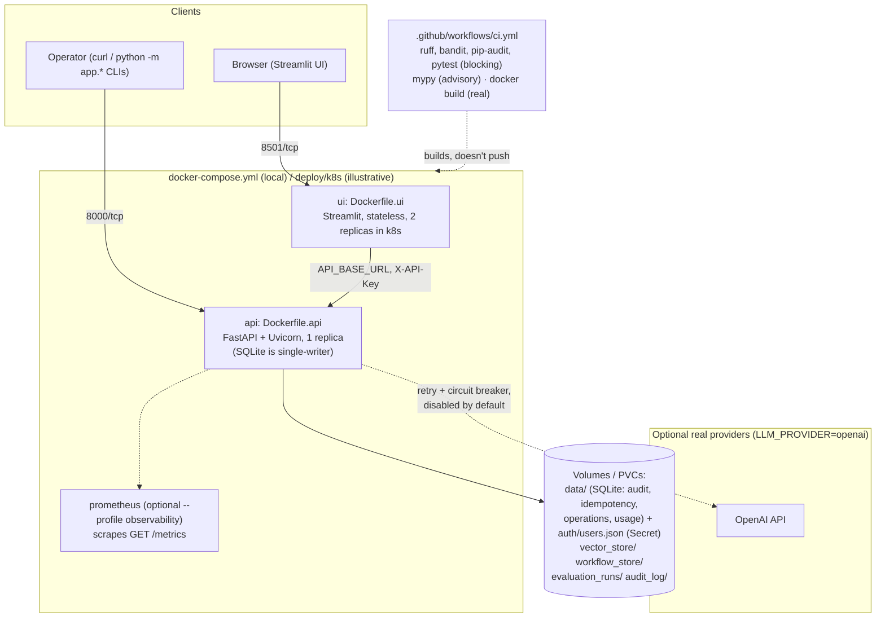

# Deployment architecture

Two ways to run the platform beyond `python -m app.api` +
`streamlit run` on a developer's own machine, both built in Milestone
8: `docker-compose.yml` for a local multi-container stack, and
`deploy/k8s/*.yaml` as an illustrative (not applied) Kubernetes
example. Neither changes anything about the platform itself — same
FastAPI app, same Streamlit frontend, same Milestones 1–7 logic.



## Local: `docker-compose.yml`

```bash
docker compose up --build                            # api + ui
docker compose --profile observability up --build     # + prometheus
```

- `api` — built from `Dockerfile.api` (two-stage: dependencies into a
  throwaway builder venv, only the venv copied into the slim runtime
  image; non-root user; `HEALTHCHECK` against the real
  `GET /api/v1/health`). Bakes in `app/`, `enterprise_knowledge_base/`,
  `data/auth/users.example.json`, and `alembic.ini`, so it runs
  standalone with zero required volume mounts.
- `ui` — built from `Dockerfile.ui`. Only copies `app/frontend/` (+
  the top-level `app/__init__.py`) — the UI never imports outside
  `app.frontend.*`, confirmed by grep before writing the Dockerfile.
  Talks to the API over HTTP only (`API_BASE_URL`, defaults to
  `http://api:8000` inside compose).
- Four named volumes (`api_data`, `api_vector_store`,
  `api_workflow_store`, `api_evaluation_runs`) hold everything the API
  generates at runtime, so state survives `docker compose down` (but
  not `docker compose down -v`).
- `ui` waits on `api`'s healthcheck (`depends_on: condition:
  service_healthy`) before starting.
- The optional `observability` profile adds a Prometheus container
  scraping `GET /metrics` using `docs/operations/prometheus.yml` — not
  auto-started, matching the platform's own "don't add infrastructure
  the milestone doesn't need" stance.

Default credentials: the committed example users
(`data/auth/users.example.json`, e.g.
`viewer-example-key-change-me`) — replace via a real volume mount
before running this anywhere but a local demo.

## Illustrative: `deploy/k8s/*.yaml`

**Not applied or deployed by this milestone** — these manifests
demonstrate what a real rollout would look like, for review rather
than `kubectl apply`. Apply order follows the numeric filename
prefixes:

| File | Contents |
|---|---|
| `00-namespace.yaml` | The `northstar` namespace |
| `01-configmap.yaml` | Non-secret env vars for the API and UI |
| `02-secrets.example.yaml` | **Placeholder values only** — provider API keys and the `AUTH_USERS_FILE` JSON, mounted as a Secret-backed volume, not env vars |
| `03-pvc.yaml` | Five `ReadWriteOnce` PVCs mirroring `docker-compose.yml`'s four named volumes, plus `audit_log` |
| `04-api.yaml` | API Deployment (`replicas: 1`, `strategy: Recreate`) + Service |
| `05-ui.yaml` | UI Deployment (`replicas: 2`) + Service |
| `06-networkpolicy.example.yaml` | UI → API only; DNS + HTTPS egress for an optional real provider |
| `07-poddisruptionbudget.example.yaml` | UI only — see below for why the API has none |

### Why the API runs a single replica

SQLite (the `northstar-data` PVC) and the local vector/workflow stores
are single-writer. `04-api.yaml` runs `replicas: 1` with
`strategy: Recreate` (not a rolling update — a second pod would
briefly try to open the same `ReadWriteOnce` PVCs, and the same SQLite
file, as the pod being replaced) and deliberately has **no**
`PodDisruptionBudget`: `minAvailable: 1` on a 1-replica Deployment
would block every voluntary eviction (node drains, cluster upgrades)
outright rather than bound disruption, which is the opposite of what a
PDB is for. Accepting brief API downtime during node maintenance is
the correct tradeoff until the API is scaled past one replica, which
requires a real multi-writer database and shared storage first — out
of this milestone's persistence scope.

### Security posture

Every container runs non-root, `readOnlyRootFilesystem: true`, and
drops all capabilities. An `emptyDir` at `/tmp` covers
`app/operations/backup.py`'s `tempfile.TemporaryDirectory()` staging
use now that the root filesystem is read-only.

## Single-process components (the multi-instance caveat)

These components are explicitly **per-process**, documented as a
scope limit rather than an oversight. Scaling the API past one replica
(which, per above, isn't possible yet without a database change
anyway) would need a shared backend for each of them:

| Component | File | What breaks with >1 replica |
|---|---|---|
| Rate limiter | `app/api/middleware/rate_limit.py` | Each replica tracks its own per-`(actor, category)` window — the effective limit multiplies by replica count |
| Circuit breaker | `app/resilience/circuit_breaker.py` | Each replica opens/closes independently — one replica's breaker opening doesn't protect the others |
| Concurrency locks/semaphores | `app/resilience/concurrency.py` | `LockRegistry`/`BoundedConcurrency` are in-process — a second replica can still start a conflicting operation |

## What was and wasn't verified

Docker and `kubectl` are not installed in the sandbox these artifacts
were authored in. What **was** verified without them: every COPY
source path in both Dockerfiles exists, `docker-compose.yml` parses as
valid YAML with the expected service/volume structure, every
`deploy/k8s/*.yaml` file parses via `yaml.safe_load_all`, and every
environment variable referenced traces correctly through
`app.config.settings`'s real parsing logic by hand. What was **not**
verified here: a real `docker build`, `docker compose up`, or
`kubectl apply --dry-run`. `.github/workflows/ci.yml`'s `docker-build`
job is the first real build verification these Dockerfiles get, on
every push to `main` and every pull request.
